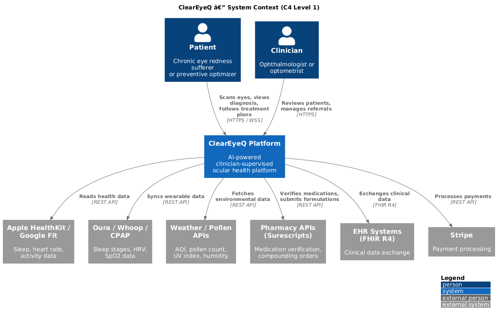
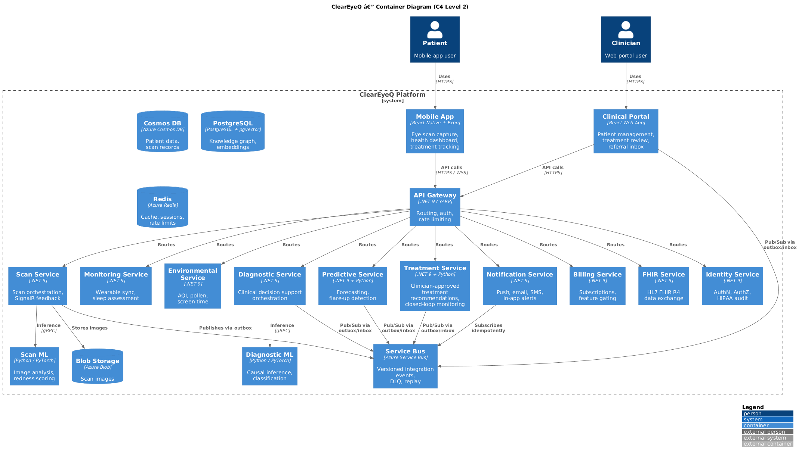
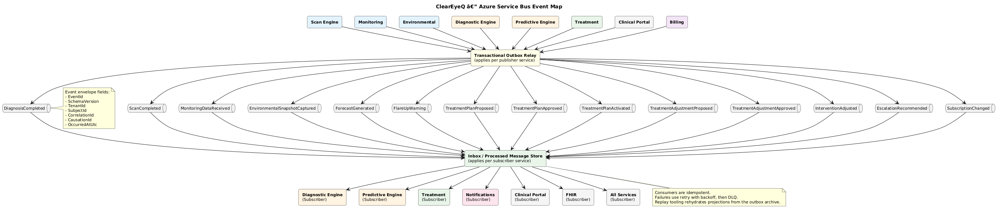
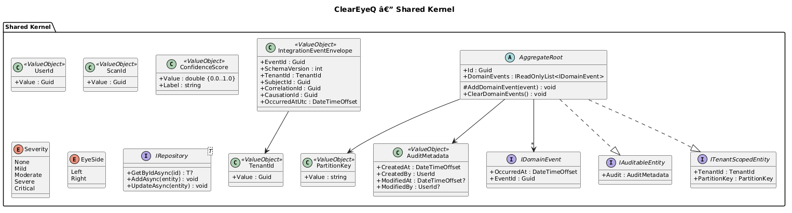

# ClearEyeQ — System Architecture

## Overview

ClearEyeQ is an AI-powered, clinician-supervised ocular health platform that transforms smartphone cameras into clinical-grade decision-support instruments. The platform uses a **hybrid .NET + Python architecture** deployed on Azure Kubernetes Service and connected through Azure Service Bus with explicit transactional messaging safeguards.

## Architecture Style

- **Microservices** — each bounded context is independently deployable
- **Clean Architecture** — Domain → Application → Infrastructure → Presentation layers per service
- **CQRS + MediatR** — command/query separation within each .NET service
- **Event-Driven with Reliability Guarantees** — Azure Service Bus plus transactional outbox, inbox deduplication, DLQ, and replay tooling
- **Hybrid Runtime** — .NET 9 for APIs/orchestration, Python for ML inference
- **Tenant-Rooted Data Model** — every document, cache key, and integration event is scoped by `TenantId`

## Bounded Contexts

| # | Context | Primary Responsibility | Runtime |
|---|---------|------------------------|---------|
| 01 | Identity & Access | AuthN, AuthZ, HIPAA audit | .NET |
| 02 | Scan Engine | Eye scan capture, image analysis | .NET + Python |
| 03 | Passive Monitoring | Continuous monitoring, wearable sync | .NET (+ on-device TFLite) |
| 04 | Environmental Context | AQI, pollen, screen time collection | .NET |
| 05 | Diagnostic Engine | Differential diagnosis, causal graphs | .NET + Python |
| 06 | Predictive Engine | 72h forecasts, flare-up detection | .NET + Python |
| 07 | Treatment Orchestration | Clinician-approved treatment recommendations and closed-loop monitoring | .NET + Python |
| 08 | Clinical Portal | Clinician-facing patient management and treatment review | .NET (BFF) |
| 09 | Notifications & Alerts | Multi-channel notification delivery | .NET |
| 10 | Subscription & Billing | Plans, feature gating, Stripe | .NET |
| 11 | FHIR Interoperability | HL7 FHIR R4 data exchange | .NET |

## Technology Stack

| Layer | Technology | Purpose |
|-------|------------|---------|
| Mobile Client | React Native + Expo | Cross-platform app, TFLite on-device ML |
| API Gateway | .NET 9 / ASP.NET Core | Routing, rate limiting, auth |
| Backend Services | .NET 9, MediatR, EF Core | Business logic, CQRS handlers |
| ML Services | Python 3.12, PyTorch, ONNX Runtime | Model training and inference |
| Real-time | SignalR | Scan feedback, live notifications |
| Messaging | Azure Service Bus + transactional outbox/inbox | Async integration events, replay, DLQ |
| Primary DB | Azure Cosmos DB | Tenant-scoped patient and workflow data |
| Analytics DB | PostgreSQL + pgvector | Knowledge graph, embeddings, read models |
| Cache | Redis | Forecasts, sessions, rate limiting, dedupe |
| Object Storage | Azure Blob Storage | Eye scan images, export bundles |
| Infrastructure | AKS, Terraform, GitHub Actions | Deployment, IaC, CI/CD |

## Clean Architecture Convention

Each .NET service follows this project structure:

```
ClearEyeQ.{Context}.Domain/         # Entities, Value Objects, Aggregates, Domain Events
ClearEyeQ.{Context}.Application/    # Commands, Queries, Handlers, Interfaces
ClearEyeQ.{Context}.Infrastructure/ # Repositories, External Clients, DB Config
ClearEyeQ.{Context}.API/            # Controllers, SignalR Hubs, Middleware
```

## CQRS Convention

- **Commands** mutate state and return void or an ID
- **Queries** read state and return DTOs
- **MediatR pipeline** behaviors: Validation → Authorization → Logging → Handler
- **Domain events** are raised inside aggregates, written to the local outbox in the same commit, and dispatched asynchronously after commit

## Shared Kernel

Value objects and interfaces shared across bounded contexts:

- `UserId`, `TenantId`, `ScanId` — strongly typed identifiers
- `Severity` — enum: None, Mild, Moderate, Severe, Critical
- `ConfidenceScore` — value object [0.0, 1.0]
- `AuditMetadata` — CreatedAt, CreatedBy, ModifiedAt, ModifiedBy
- `IDomainEvent` — base interface for in-process domain events
- `IntegrationEventEnvelope` — `EventId`, `SchemaVersion`, `TenantId`, `SubjectId`, `CorrelationId`, `CausationId`, `OccurredAtUtc`
- `IAuditableEntity` — interface for HIPAA-auditable entities
- `ITenantScopedEntity` — interface for tenant-scoped persistence models

## Clinical Safety Convention

1. **Decision support, not autonomous care** — Diagnostic, Predictive, and Treatment outputs are CDS artifacts, not autonomous medical orders.
2. **Clinician approval for high-risk actions** — Medication initiation, discontinuation, dose changes, compounding orders, and specialist escalation decisions require licensed clinician approval before activation.
3. **Guardrailed automation only** — Only low-risk behavioral or environmental reminders already approved inside an active treatment plan may execute automatically.

## Tenant Isolation Convention

1. **TenantId everywhere** — every JWT, aggregate, read model, cache key, audit entry, and integration event carries `TenantId`.
2. **Tenant-rooted partitioning** — tenant-wide entities use `TenantId` as the physical partition key.
3. **Scalable user workloads** — high-cardinality subject data uses synthetic keys rooted in tenancy, for example `TenantId|UserId`.
4. **Cross-tenant blocking** — repository filters, bus consumers, and cache resolvers all validate tenant scope before reading or mutating data.

## Messaging Reliability Convention

1. **Transactional outbox** — each service writes integration events to a local outbox in the same transaction as state changes.
2. **Relay publisher** — a background relay publishes outbox records to Service Bus with schema-versioned envelopes.
3. **Inbox deduplication** — consumers persist processed-message markers before side effects so retries and replay are idempotent.
4. **Operational safeguards** — exponential backoff, poison-message routing, dead-letter queues, and replay tooling are mandatory for production topics.
5. **Contract governance** — event names and payload schemas are centrally versioned and compatibility-tested.

## Data Lifecycle and Privacy Erasure

1. **Operational PHI** — user-facing PHI stores and blobs are deleted or cryptographically shredded within 72 hours where legally permissible.
2. **Immutable ledgers** — audit, billing, and safety records remain append-only; privacy erasure replaces direct identifiers with irreversible tenant-scoped tokens instead of mutating history.
3. **Read-model cleanup** — projections, caches, and search indexes are invalidated as part of the same privacy-erasure workflow.
4. **Retention classes** — each bounded context declares whether data is operational PHI, immutable audit, billing record, or de-identified learning artifact.

## HIPAA Compliance Strategy

1. **Encryption at rest** — AES-256 via Azure Storage Service Encryption, Cosmos DB encryption, and PostgreSQL TDE/disk encryption
2. **Encryption in transit** — TLS 1.3 enforced on all public and internal endpoints
3. **Audit logging** — every PHI access and privileged mutation is logged with user, timestamp, resource, action, and tenant
4. **Access controls** — RBAC plus tenant isolation at request, query, and event-processing layers
5. **Data retention** — configurable retention classes with automated purge or anonymization jobs
6. **Privacy erasure** — coordinated delete/crypto-shred workflow for operational PHI plus tokenization of immutable records

## Diagrams

### System Context (C4 Level 1)


### Container Diagram (C4 Level 2)


### Async Messaging Map


### Shared Kernel

