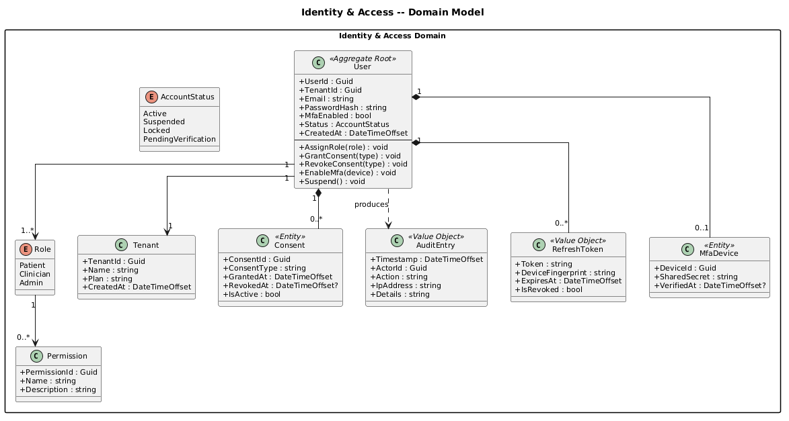
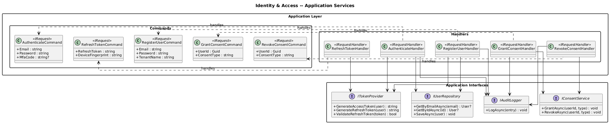
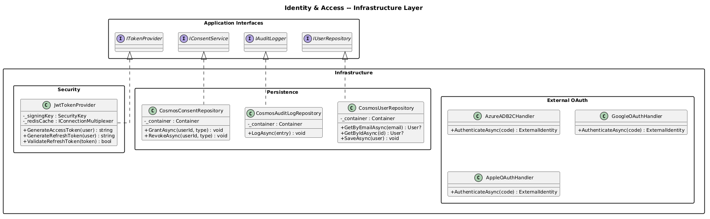
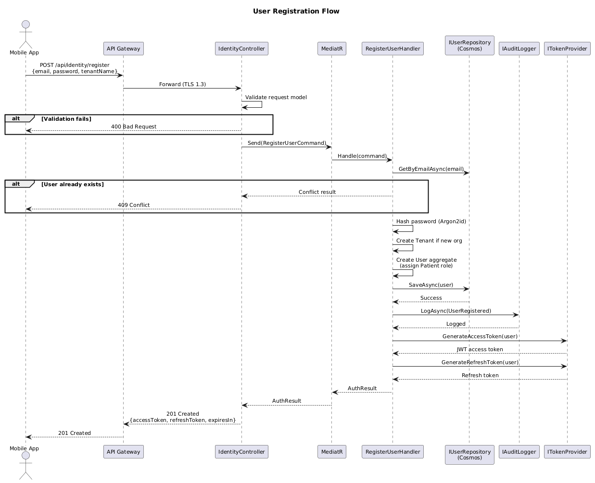
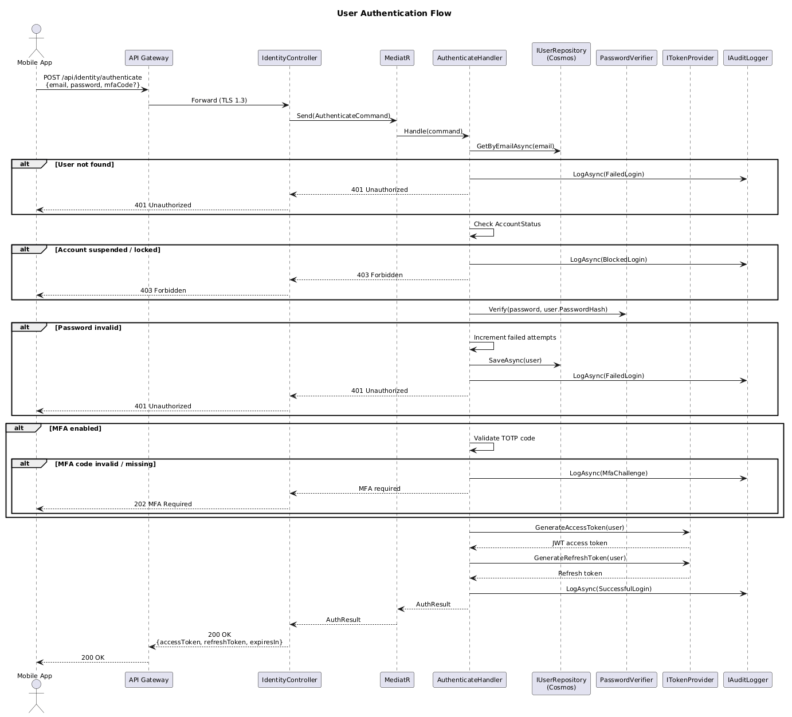
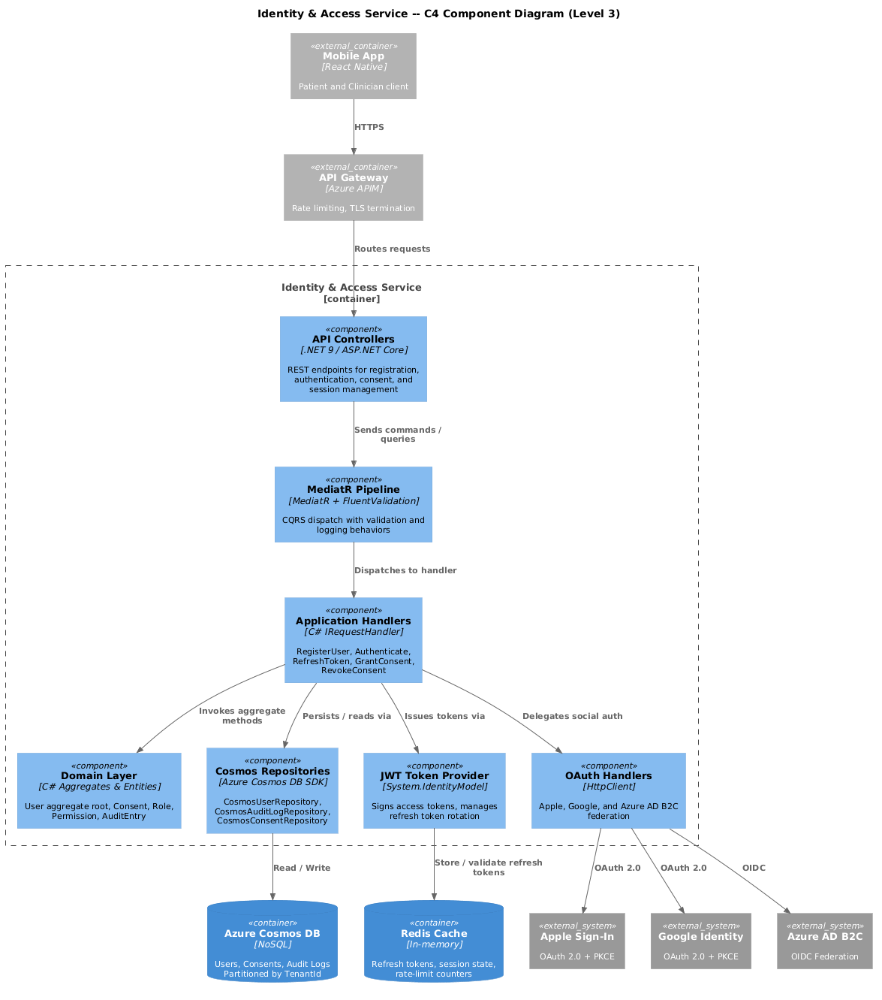

# Identity and Access -- Detailed Design

## 1. Overview

The **Identity and Access** bounded context owns every aspect of user identity
lifecycle management, authentication, authorization, and compliance-driven audit
logging within ClearEyeQ. It is the gateway through which every actor--Patient,
Clinician, or Admin--establishes trust with the platform.

Because ClearEyeQ processes Protected Health Information (PHI), this context
enforces HIPAA Administrative Safeguards (45 CFR 164.312) including unique user
identification, automatic logoff, encryption, and audit controls.

---

## 2. Responsibilities

| Responsibility | Description |
|---|---|
| **User Registration** | Self-service sign-up for Patients; Admin-invited onboarding for Clinicians. Tenant provisioning on first organization registration. |
| **Authentication** | Password-based login with Argon2id hashing, plus federated OAuth 2.0 via Apple Sign-In and Google Identity. |
| **Multi-Factor Authentication** | TOTP-based MFA enforced for Clinician and Admin roles; optional for Patients. |
| **Role-Based Authorization** | Three static roles (Patient, Clinician, Admin) with fine-grained Permissions resolved at request time. |
| **Tenant-Scoped Isolation** | Every data query is scoped to the caller's TenantId via a Cosmos DB partition key, preventing cross-tenant data leakage. |
| **Consent Management** | Records and enforces patient consent grants (data sharing, marketing, research) with full revocation history. |
| **Session Management** | Short-lived JWT access tokens (15 min) paired with rotating refresh tokens stored in Redis. Automatic logoff after inactivity. |
| **HIPAA Audit Logging** | Immutable, append-only audit trail for every authentication event, consent change, and privilege escalation. |

---

## 3. Domain Concepts

### Aggregate Root -- User

The `User` aggregate encapsulates identity, credentials, role assignments,
consent records, and account status. All mutations flow through the aggregate to
enforce invariants (e.g., a user cannot authenticate while suspended).

### Entities and Value Objects

- **Tenant** -- Organizational boundary; partition key for all queries.
- **Role** (enum) -- Patient, Clinician, Admin.
- **Permission** -- Granular capability attached to a Role (e.g., `ViewScan`, `PrescribeTreatment`).
- **Consent** -- Tracks a specific consent type with grant/revoke timestamps.
- **AuditEntry** -- Immutable value object recording who did what, when, and from where.
- **RefreshToken** -- Opaque rotating token bound to a device fingerprint.
- **MfaDevice** -- Registered TOTP device with a shared secret.

---

## 4. Diagrams

### 4.1 Domain Model

### 4.2 Application Services

### 4.3 Infrastructure Layer

### 4.4 Registration Flow

### 4.5 Authentication Flow

### 4.6 C4 Component View

---

## 5. Bounded Context Boundaries

### Upstream Dependencies

| Context | Interaction | Mechanism |
|---|---|---|
| None | This context has no upstream domain dependencies. | -- |

### Downstream Consumers

| Context | What They Need | Mechanism |
|---|---|---|
| **Scan Engine** | Authenticated user identity, TenantId, role claims | JWT bearer token |
| **Diagnostic Engine** | Clinician identity verification | JWT bearer token |
| **Clinical Portal** | Session validation, role-based UI gating | Token introspection |
| **Notifications** | User contact details for MFA delivery | Async integration event |
| **Subscription & Billing** | TenantId and user count for plan enforcement | Integration event |

### Anti-Corruption Layer

External OAuth providers (Apple, Google) are wrapped behind dedicated handler
classes (`AppleOAuthHandler`, `GoogleOAuthHandler`) that normalize external
identity tokens into internal `ExternalIdentity` value objects. This prevents
provider-specific schemas from leaking into the domain.

---

## 6. Integration Points

| Integration | Direction | Protocol | Notes |
|---|---|---|---|
| Azure AD B2C | Outbound | OIDC / OAuth 2.0 | Optional enterprise SSO federation |
| Apple Sign-In | Outbound | OAuth 2.0 + PKCE | Mobile-only flow |
| Google Identity | Outbound | OAuth 2.0 + PKCE | Mobile and web |
| Azure Cosmos DB | Internal | SDK (SQL API) | User store, audit log, consent store |
| Redis Cache | Internal | StackExchange.Redis | Refresh token store, session cache |
| MediatR Pipeline | Internal | In-process | CQRS command/query dispatch |

---

## 7. Key Design Decisions

1. **Argon2id for password hashing** -- Resistant to GPU and side-channel
   attacks; recommended by OWASP for new systems.
2. **Short-lived JWTs + rotating refresh tokens** -- Limits blast radius of
   token theft while maintaining smooth UX.
3. **Cosmos DB partition key = TenantId** -- Physical tenant isolation at the
   storage layer; eliminates accidental cross-tenant reads.
4. **Immutable audit log** -- Cosmos DB change-feed backs the audit container;
   no update or delete operations permitted via repository.
5. **MFA enforcement by role** -- Clinicians and Admins must enroll MFA before
   first PHI access; Patients may opt in.

---

## 8. HIPAA Compliance Mapping

| HIPAA Requirement (45 CFR 164.312) | Implementation |
|---|---|
| Unique User Identification | UserId (GUID) assigned at registration |
| Emergency Access Procedure | Admin break-glass flow with elevated audit |
| Automatic Logoff | 15-min access token TTL; idle session timeout |
| Encryption | TLS 1.3 in transit; Cosmos DB encryption at rest |
| Audit Controls | Append-only AuditEntry per event |
| Integrity Controls | Cosmos DB ETag-based optimistic concurrency |
| Person or Entity Authentication | Password + MFA; OAuth with PKCE |
