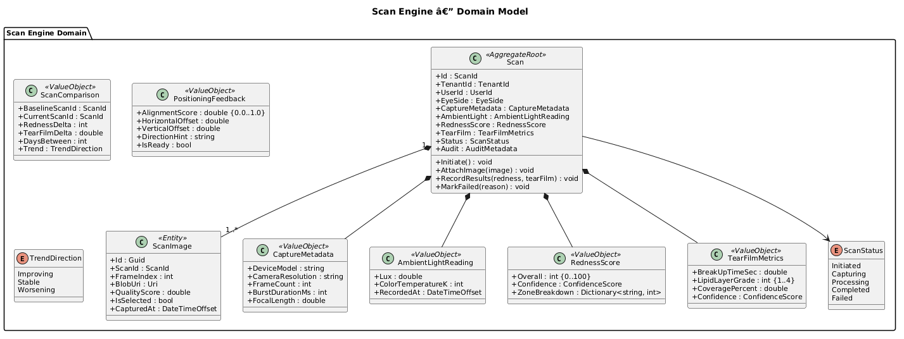
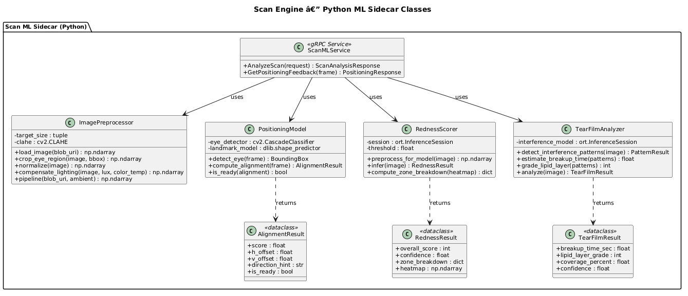
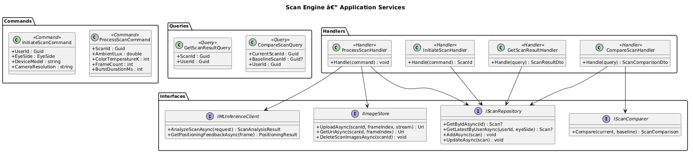
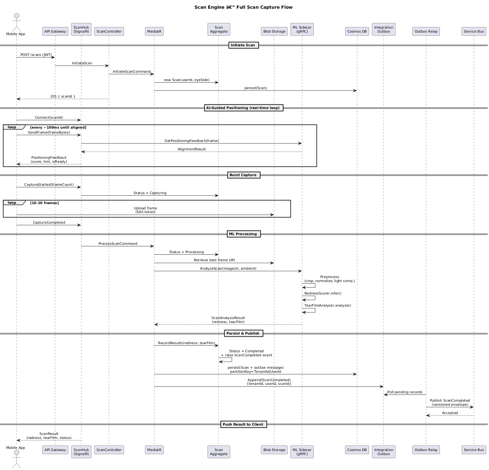
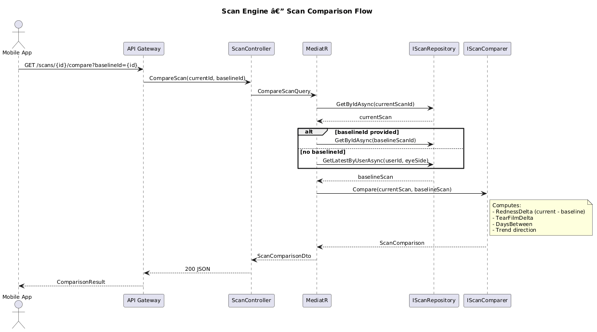
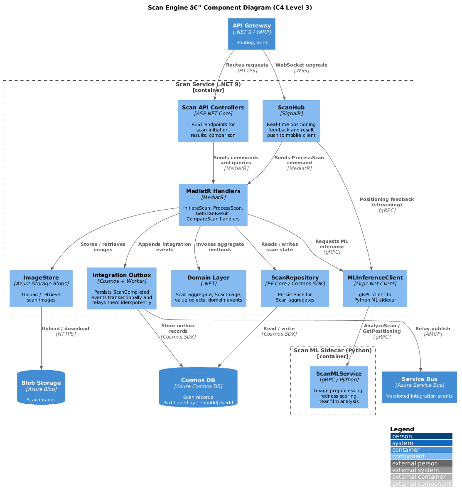

# Scan Engine --- Detailed Design

## Overview

The Scan Engine bounded context is responsible for the full lifecycle of an eye scan: coordinating multi-frame burst capture from the mobile device camera, providing real-time AI-guided positioning feedback, preprocessing captured images, computing redness and tear film metrics via a Python ML sidecar, persisting results, and enabling comparison to prior scans. It does **not** perform diagnosis --- that responsibility belongs to the Diagnostic Engine.

## Responsibilities

- **Burst Capture Coordination** --- orchestrate 10--20 frame bursts from the device camera, selecting the best frame via quality scoring.
- **AI-Guided Positioning** --- deliver real-time positioning feedback over SignalR so the user can align their eye within the camera viewfinder before capture begins.
- **Ambient Light Compensation** --- record and compensate for ambient lighting conditions to normalize image analysis.
- **Image Preprocessing** --- crop, resize, normalize, and color-correct captured frames before inference.
- **Redness Scoring** --- produce a 0--100 redness score via ONNX model inference in the Python sidecar.
- **Tear Film Analysis** --- detect interference patterns and compute tear film stability metrics.
- **Scan History** --- persist all scan records and images for longitudinal tracking.
- **Scan Comparison** --- compute deltas between the current scan and a baseline (previous or user-selected) scan.
- **Event Publishing** --- emit `ScanCompleted` integration events through a transactional outbox so downstream contexts (Diagnostic Engine, Predictive Engine, Billing) can react reliably.

## Boundaries

| In Scope | Out of Scope |
|----------|-------------|
| Frame capture coordination | Clinical diagnosis |
| Positioning feedback loop | Treatment recommendations |
| Image preprocessing & storage | Predictive forecasting |
| Redness & tear film scoring | Notification delivery |
| Scan comparison | Billing / feature gating |

## Domain Concepts

| Concept | Description |
|---------|-------------|
| **Scan** | Aggregate root representing a single eye scan session for one eye. |
| **ScanImage** | An individual image frame captured during a burst, stored in Blob Storage. |
| **CaptureMetadata** | Device info, camera settings, frame count, and burst duration. |
| **AmbientLightReading** | Lux value and color temperature recorded at capture time. |
| **RednessScore** | Normalized 0--100 score with confidence and zone breakdown. |
| **TearFilmMetrics** | Break-up time estimate, lipid layer grade, and coverage percentage. |
| **ScanComparison** | Value object holding the delta between two scans. |
| **PositioningFeedback** | Real-time guidance: alignment score, directional hints, ready flag. |
| **ScanStatus** | Lifecycle enum: Initiated, Capturing, Processing, Completed, Failed. |

## Component Descriptions

### Scan API Controllers
ASP.NET Core controllers exposing REST endpoints for initiating scans, retrieving results, and requesting comparisons. Authenticated via JWT bearer tokens forwarded from the API Gateway.

### SignalR Hub (ScanHub)
WebSocket hub that streams positioning feedback to the mobile client during the alignment phase and pushes final results once processing completes.

### MediatR Command / Query Handlers
CQRS handlers for `InitiateScanCommand`, `ProcessScanCommand`, `GetScanResultQuery`, and `CompareScanQuery`. Pipeline behaviors handle validation, authorization, and logging.

### Domain Layer
The Scan aggregate root, ScanImage entity, value objects (CaptureMetadata, AmbientLightReading, RednessScore, TearFilmMetrics, ScanComparison, PositioningFeedback), and the ScanStatus enum.

### Python ML Sidecar
A gRPC service running in a separate container. Hosts the image preprocessor (OpenCV), positioning model (eye detection + alignment scoring), redness scorer (ONNX Runtime), and tear film analyzer (interference pattern detection).

### Azure Blob Storage
Stores raw and preprocessed scan images in tenant-scoped containers. Blobs are keyed by `{TenantId}/{UserId}/{ScanId}/{FrameIndex}.webp`.

### Azure Cosmos DB
Persists Scan aggregate state, including all value objects, in a single document per scan. All documents carry `TenantId`; high-cardinality scan records use the synthetic partition key `TenantId|UserId`.

### Azure Service Bus
Receives versioned `ScanCompleted` integration events relayed from the scan outbox after the scan commit succeeds. Subscribers process them idempotently via inbox deduplication.

## Reliability and Isolation

- **Tenant-rooted scope** --- every scan aggregate, blob path, cache entry, and integration event carries `TenantId`.
- **Transactional outbox** --- `ScanCompleted` is written to the local outbox in the same commit as the completed scan record.
- **Idempotent consumers** --- downstream services acknowledge only after persisting their processed-message marker.
- **Privacy erasure** --- operational scan records and blobs are deleted or cryptographically shredded through the platform privacy-erasure workflow; immutable audit references retain only irreversible tokens.

## Diagrams

### Domain Model

### ML Service Classes

### Application Services

### Scan Capture Sequence

### Scan Comparison Sequence

### C4 Component Diagram

