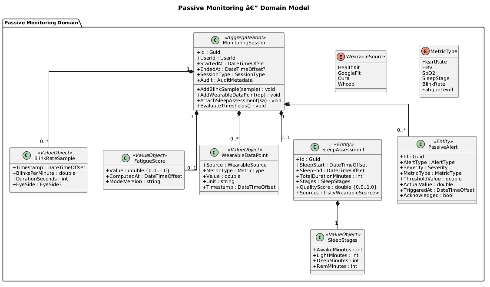
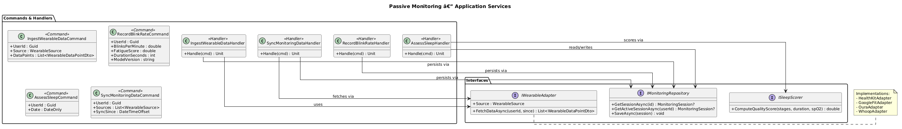
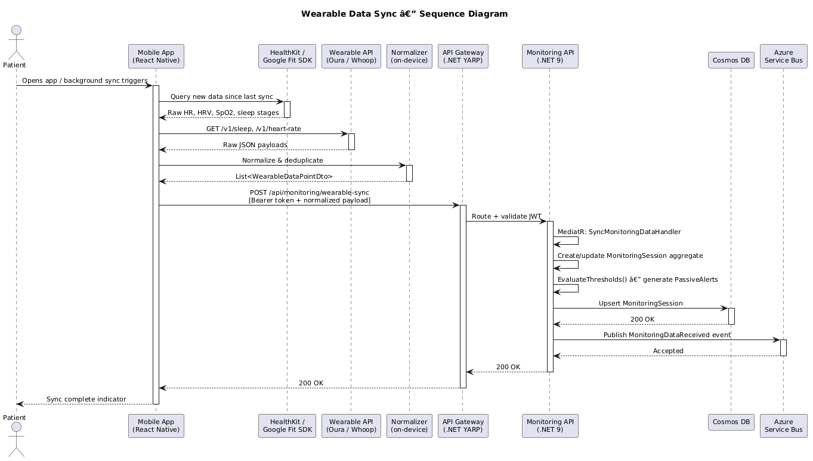
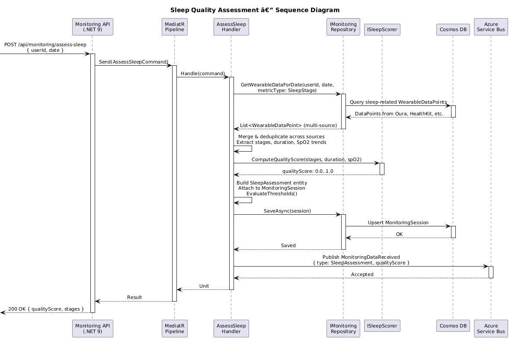
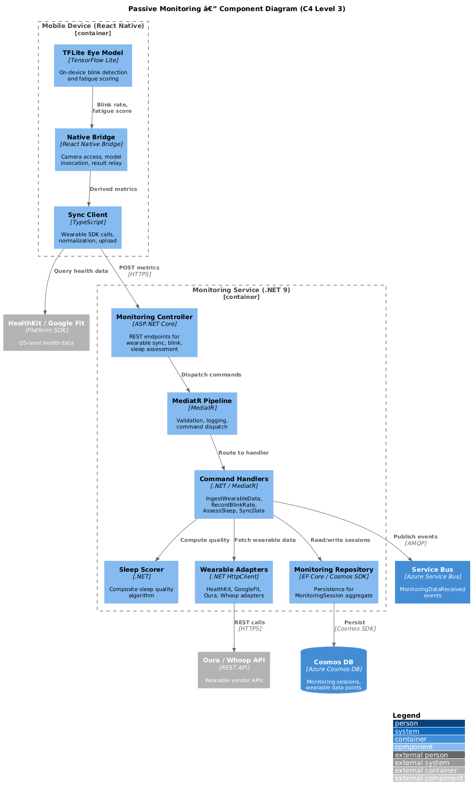

# Passive Monitoring — Detailed Design

## Overview

The Passive Monitoring bounded context provides continuous, non-intrusive ocular health surveillance by combining on-device computer vision with wearable biometric data. It operates across two runtimes: a TensorFlow Lite model running on the user's mobile device for blink rate and fatigue detection, and a .NET 9 backend service for wearable data ingestion, sleep quality assessment, and threshold-based alerting.

## Responsibilities

- **Blink Rate / Fatigue Detection** — Run a TFLite eye-tracking model via the front camera in React Native; compute blink rate and fatigue score on-device; transmit only derived numeric metrics to the backend.
- **Wearable Data Ingestion** — Sync heart rate, HRV, SpO2, and sleep stage data from Oura, Whoop, Apple Watch (HealthKit), and Google Fit through platform-specific adapters.
- **Sleep Quality Assessment** — Aggregate multi-source sleep data (wearable sleep stages, duration, SpO2 trends) into a composite sleep quality score.
- **Bedside Camera Morning Assessment** — Capture a brief front-camera session on wake-up to evaluate morning eye redness and puffiness, processing on-device and sending only derived scores.
- **Threshold-Based Alerting** — Evaluate incoming metrics against user-specific and clinical thresholds; generate passive alerts for anomalies such as sustained low blink rate, poor sleep quality, or abnormal SpO2.
- **Event Publishing** — Publish `MonitoringDataReceived` domain events to Azure Service Bus for downstream consumption by the Diagnostic Engine and Predictive Engine.

## Boundaries

| Concern | Owned by Passive Monitoring | Owned Elsewhere |
|---------|----------------------------|-----------------|
| Blink rate ML inference | On-device TFLite model | — |
| Wearable API integration | Adapter layer | — |
| Sleep quality scoring | SleepScorer service | — |
| Clinical diagnosis from metrics | — | Diagnostic Engine (05) |
| 72-hour flare-up forecasting | — | Predictive Engine (06) |
| Alert delivery (push, SMS) | — | Notifications & Alerts (09) |
| User authentication | — | Identity & Access (01) |

## Privacy Model

1. **On-Device ML Only** — The TFLite blink detection and fatigue scoring models run entirely on the mobile device. No camera frames, video, or images are transmitted to the backend.
2. **Derived Metrics Only** — The mobile app sends only numeric values: blink rate (blinks/min), fatigue score (0.0-1.0), morning assessment scores. Raw sensor data from wearables is normalized and reduced to metric-level data points before storage.
3. **Encrypted Transit** — All metric payloads are transmitted over TLS 1.3 to the .NET Monitoring API.
4. **HIPAA-Auditable Storage** — Metrics stored in Cosmos DB are encrypted at rest (AES-256) and tagged with `AuditMetadata` for full access traceability.
5. **User Consent Gating** — Each wearable source and camera feature requires explicit user opt-in, tracked in Identity & Access.

## Integration Points

| Direction | System | Protocol | Payload |
|-----------|--------|----------|---------|
| Inbound | React Native (on-device TFLite) | HTTPS | BlinkRateSample, FatigueScore |
| Inbound | HealthKit / Google Fit | Platform SDK | Heart rate, HRV, SpO2, sleep stages |
| Inbound | Oura API | HTTPS REST | Sleep stages, HRV, readiness |
| Inbound | Whoop API | HTTPS REST | Recovery, strain, sleep |
| Outbound | Azure Service Bus | AMQP | MonitoringDataReceived event |
| Outbound | Cosmos DB | SDK | Persisted monitoring sessions |
| Consumed by | Diagnostic Engine | Service Bus subscription | MonitoringDataReceived |
| Consumed by | Predictive Engine | Service Bus subscription | MonitoringDataReceived |

## Diagrams

### Domain Model

### Application Services

### Wearable Sync Sequence

### Sleep Assessment Sequence

### Component Diagram (C4 Level 3)

