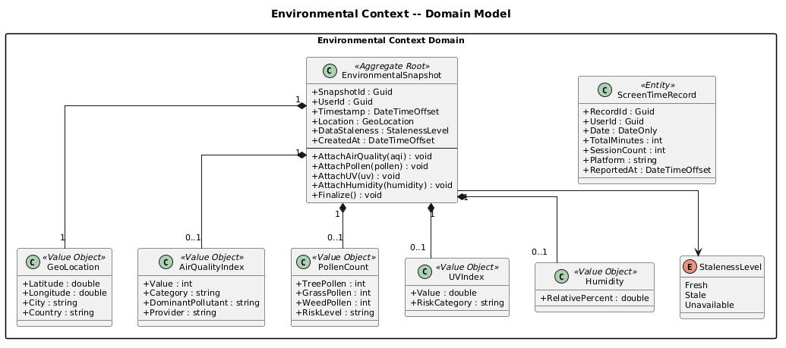
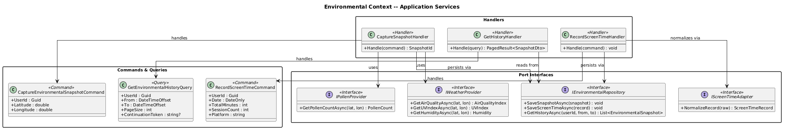
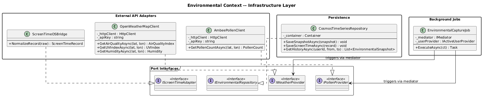
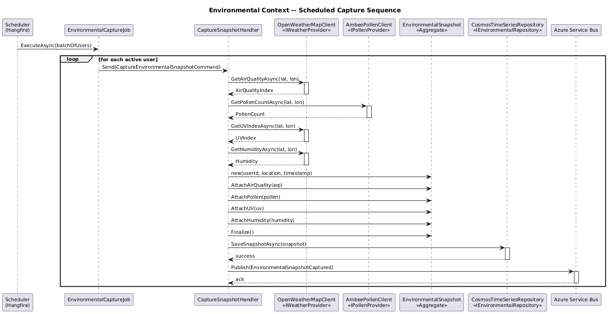
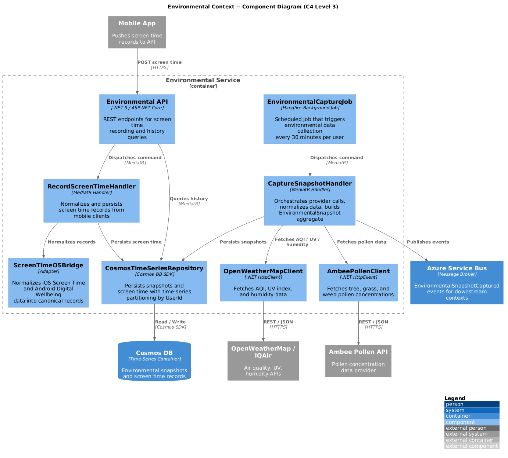

# Environmental Context -- Detailed Design

## 1. Overview

The **Environmental Context** bounded context is responsible for periodic
collection, normalization, and time-series storage of environmental and
behavioral factors that influence ocular health. It gathers air quality indices,
pollen counts, UV exposure, humidity levels, and screen time records, then
publishes unified snapshots for downstream analytical engines.

This context is **pure data collection** -- it performs no diagnosis, prediction,
or recommendation. Its sole purpose is to produce high-fidelity, timestamped
environmental data that the Diagnostic Engine and Predictive Engine consume as
causal inputs.

---

## 2. Responsibilities

| Responsibility | Description |
|---|---|
| **Air Quality Collection** | Periodically fetches AQI data from OpenWeatherMap and IQAir APIs based on the user's geolocation. |
| **Pollen Count Collection** | Retrieves pollen concentration data (tree, grass, weed) from the Ambee Pollen API. |
| **UV Index & Humidity** | Fetches current UV index and relative humidity from weather APIs. |
| **Screen Time Tracking** | Ingests screen time records via iOS Screen Time and Android Digital Wellbeing OS APIs through the mobile client. |
| **Geolocation Resolution** | Resolves the user's current or home location to drive location-aware environmental queries. |
| **Time-Series Storage** | Persists all collected data in Cosmos DB with time-series partitioning for efficient range queries. |
| **Data Normalization** | Normalizes heterogeneous API responses into canonical value objects with consistent units and scales. |
| **Snapshot Publishing** | Publishes `EnvironmentalSnapshot` integration events to Azure Service Bus after each collection cycle. |

---

## 3. Domain Concepts

### Aggregate Root -- EnvironmentalSnapshot

The `EnvironmentalSnapshot` aggregate represents a single point-in-time capture
of all environmental and behavioral factors for a given user and location. It is
immutable once persisted -- environmental data is append-only.

### Value Objects

- **AirQualityIndex** -- AQI value (0--500), EPA category, and dominant pollutant.
- **PollenCount** -- Tree, grass, and weed pollen concentrations in grains/m cubed.
- **UVIndex** -- UV radiation intensity (0--11+) with exposure risk category.
- **Humidity** -- Relative humidity percentage (0--100%).

### Entities

- **ScreenTimeRecord** -- Daily screen time duration and session count, linked to a user and date. Tracked as an entity because it has identity (per user, per day) and may be updated as the day progresses.

---

## 4. Diagrams

### 4.1 Domain Model

### 4.2 Application Services

### 4.3 Infrastructure Layer

### 4.4 Environmental Capture Sequence

### 4.5 C4 Component View

---

## 5. Bounded Context Boundaries

### Upstream Dependencies

| Context | What We Need | Mechanism |
|---|---|---|
| **Identity & Access** | Authenticated UserId and TenantId from JWT claims | JWT bearer token |

### Downstream Consumers

| Context | What They Consume | Mechanism |
|---|---|---|
| **Diagnostic Engine** | `EnvironmentalSnapshot` events for causal factor analysis | Azure Service Bus subscription |
| **Predictive Engine** | `EnvironmentalSnapshot` events and historical time-series for 72h forecasting | Azure Service Bus subscription + query API |

### Anti-Corruption Layer

External environmental APIs (OpenWeatherMap, IQAir, Ambee) return provider-
specific JSON schemas with varying units, scales, and error conventions. Each
provider is wrapped behind a dedicated adapter client that normalizes responses
into canonical domain value objects (AirQualityIndex, PollenCount, UVIndex,
Humidity). This prevents third-party schema drift from leaking into the domain.

Screen time data from iOS Screen Time and Android Digital Wellbeing is similarly
normalized through the `ScreenTimeOSBridge` adapter, which abstracts platform
differences behind a unified `IScreenTimeAdapter` interface.

---

## 6. External API Integrations

| Provider | Data | Protocol | Rate Limits | Fallback |
|---|---|---|---|---|
| OpenWeatherMap | AQI, UV index, humidity | REST / JSON | 1000 calls/day (free tier) | IQAir as secondary provider |
| IQAir | AQI (backup) | REST / JSON | 10,000 calls/month | Cached last-known value |
| Ambee Pollen | Tree, grass, weed pollen | REST / JSON | 100 calls/day | Cached last-known value |
| iOS Screen Time | Daily screen time | On-device API via mobile client | N/A (local) | User self-report |
| Android Digital Wellbeing | Daily screen time | On-device API via mobile client | N/A (local) | User self-report |

---

## 7. Key Design Decisions

1. **Append-only snapshots** -- Environmental data is immutable once captured.
   No updates or deletes. This simplifies auditing and enables reliable
   time-series analysis.
2. **Cosmos DB time-series partitioning** -- Partition key is `UserId`, sort key
   is `Timestamp`. This optimizes the primary access pattern: "get environmental
   history for a user over a date range."
3. **Scheduled background job** -- A recurring Hangfire/Quartz job triggers
   collection every 30 minutes per active user, batched to respect API rate
   limits.
4. **Provider fallback chain** -- If the primary weather provider fails,
   the system falls back to the secondary provider, then to the most recent
   cached value. Stale data is flagged with a `DataStaleness` indicator.
5. **Screen time pushed from client** -- Screen time data is pushed from the
   mobile app rather than pulled, because OS APIs only expose this data
   on-device. The backend records and normalizes what the client reports.
6. **Normalization at ingestion** -- All values are normalized to canonical
   units immediately upon receipt, not at query time. This keeps downstream
   consumers simple and consistent.

---

## 8. Collection Schedule

| Data Type | Frequency | Trigger |
|---|---|---|
| AQI | Every 30 minutes | Scheduled background job |
| Pollen count | Every 60 minutes | Scheduled background job |
| UV index | Every 30 minutes | Scheduled background job |
| Humidity | Every 30 minutes | Scheduled background job |
| Screen time | On app foreground + daily sync | Mobile client push |
