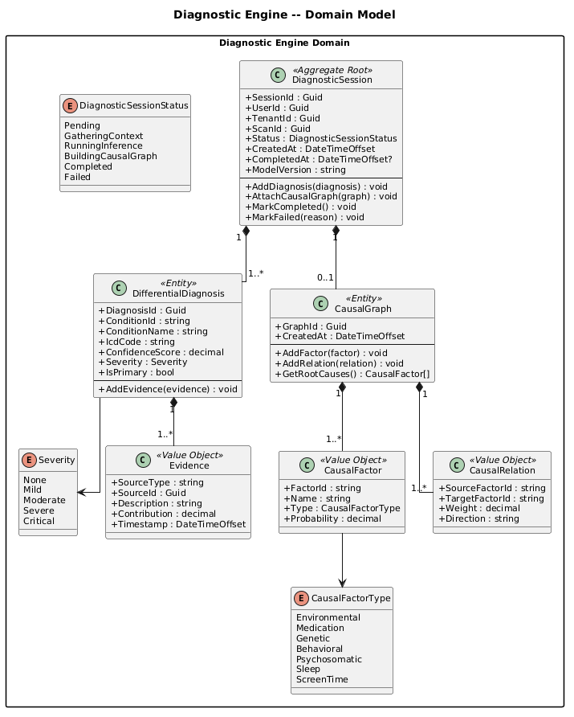
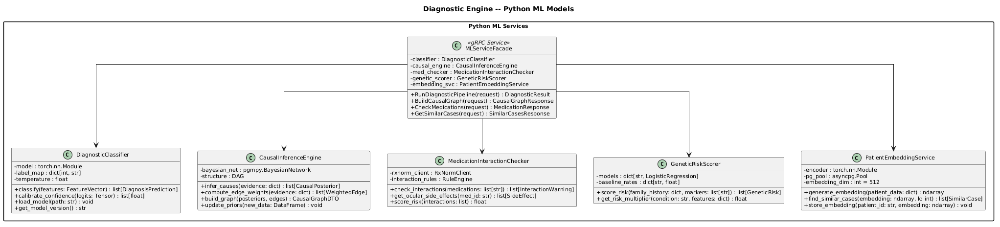
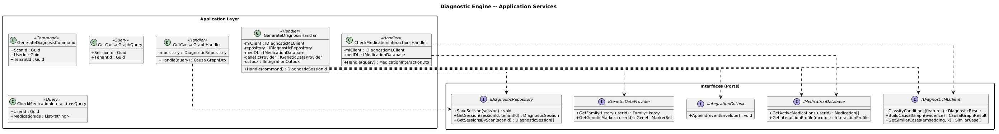
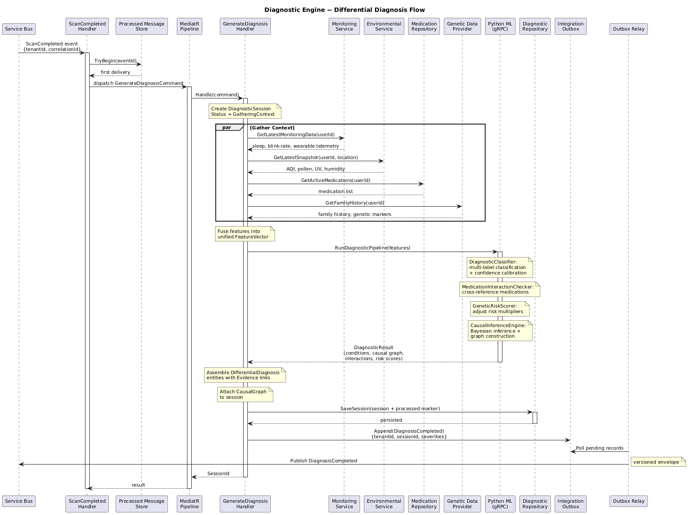
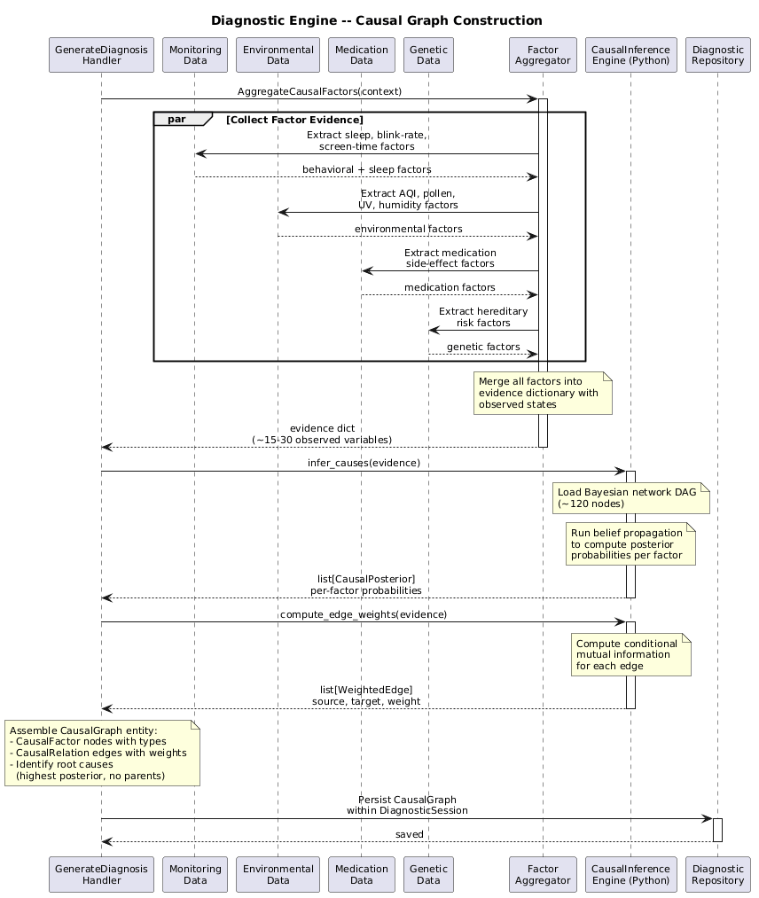
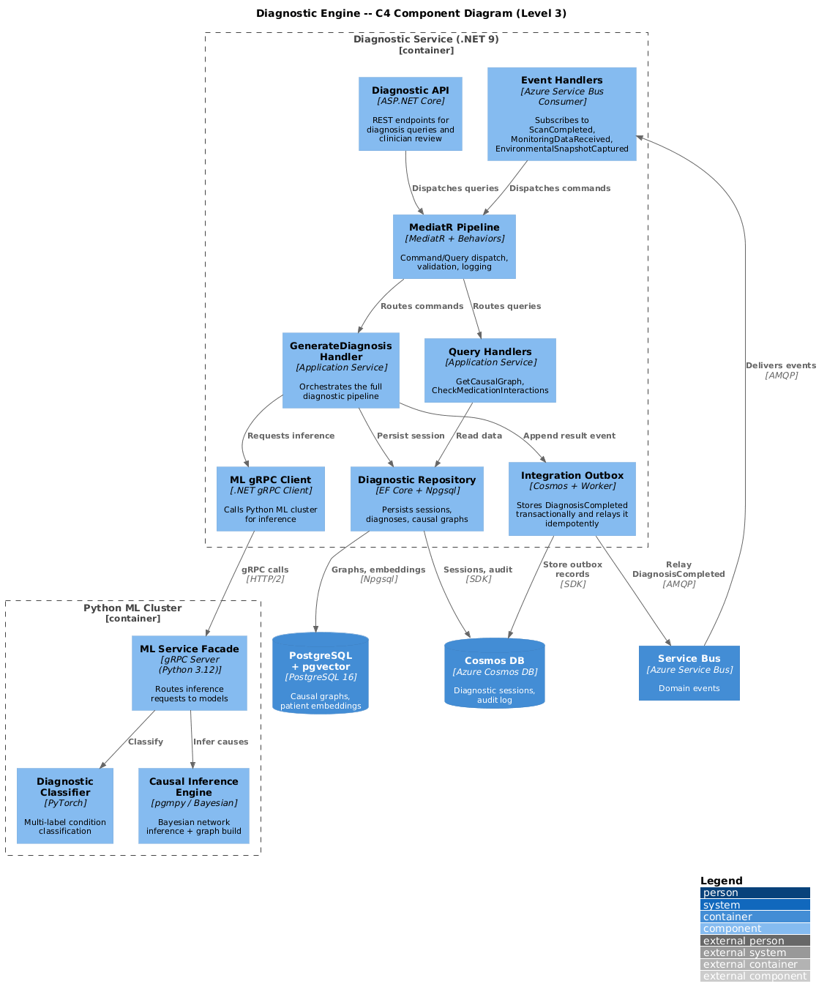

# Diagnostic Engine -- Detailed Design

## 1. Overview

The **Diagnostic Engine** bounded context is the clinical reasoning core of
ClearEyeQ. It consumes scan imagery analysis, passive monitoring telemetry, and
environmental context to produce differential diagnoses across 47+ ocular
conditions, construct causal graphs linking symptoms to root factors, evaluate
medication interactions, score genetic predispositions, and detect psychosomatic
patterns.

The context is a hybrid .NET 9 + Python service. The .NET layer orchestrates
workflows via MediatR CQRS handlers and manages the diagnostic session
aggregate. The Python layer hosts ML models for multi-label diagnostic
classification (PyTorch), Bayesian causal inference, and patient embedding
similarity search (pgvector).

---

## 2. Responsibilities

| Responsibility | Description |
|---|---|
| **Differential Diagnosis** | Multi-label classification across 47+ ocular conditions with per-condition confidence scores and severity ratings. |
| **Causal Graph Construction** | Maps observed symptoms to immune, endocrine, neurological, environmental, behavioral, sleep, screen-time, and psychosomatic causal factors using Bayesian networks. |
| **Medication Interaction Analysis** | Cross-references the patient's active medications against known ocular side-effect profiles and drug-drug interaction databases. |
| **Genetic Predisposition Scoring** | Scores risk elevation for heritable conditions (e.g., glaucoma, macular degeneration) based on patient-reported family history and optional genetic markers. |
| **Psychosomatic Pattern Detection** | Identifies stress-correlated flare patterns by correlating symptom timelines with sleep quality, screen time, and self-reported stress indicators. |
| **Confidence Scoring** | Produces calibrated confidence scores [0.0, 1.0] for every diagnosis, with evidence linking back to specific scan regions, monitoring readings, or environmental data points. |
| **Evidence Linking** | Attaches traceable evidence references to each diagnosis so clinicians can audit the reasoning chain. |
| **Similar-Case Retrieval** | Uses patient embeddings (pgvector) to surface historically similar cases for clinical decision support. |

---

## 3. Ocular Conditions Taxonomy (47+)

### Anterior Segment

| # | Condition | ICD-10 | Category |
|---|-----------|--------|----------|
| 1 | Allergic Conjunctivitis | H10.1 | Allergic |
| 2 | Bacterial Conjunctivitis | H10.0 | Infectious |
| 3 | Viral Conjunctivitis | B30 | Infectious |
| 4 | Giant Papillary Conjunctivitis | H10.41 | Allergic |
| 5 | Anterior Uveitis (Iritis) | H20.0 | Inflammatory |
| 6 | Episcleritis | H15.1 | Inflammatory |
| 7 | Scleritis | H15.0 | Inflammatory |
| 8 | Bacterial Keratitis | H16.0 | Infectious |
| 9 | Herpes Simplex Keratitis | B00.52 | Infectious |
| 10 | Fungal Keratitis | H16.06 | Infectious |
| 11 | Acanthamoeba Keratitis | B60.1 | Infectious |
| 12 | Corneal Abrasion | S05.0 | Traumatic |
| 13 | Corneal Ulcer | H16.0 | Infectious |
| 14 | Dry Eye Syndrome | H04.12 | Degenerative |
| 15 | Blepharitis | H01.0 | Inflammatory |
| 16 | Meibomian Gland Dysfunction | H00.1 | Inflammatory |
| 17 | Pterygium | H11.0 | Degenerative |
| 18 | Pinguecula | H11.1 | Degenerative |
| 19 | Subconjunctival Hemorrhage | H11.3 | Vascular |

### Posterior Segment

| # | Condition | ICD-10 | Category |
|---|-----------|--------|----------|
| 20 | Diabetic Retinopathy (NPDR) | E11.319 | Vascular |
| 21 | Diabetic Retinopathy (PDR) | E11.359 | Vascular |
| 22 | Diabetic Macular Edema | E11.311 | Vascular |
| 23 | Age-Related Macular Degeneration (Dry) | H35.31 | Degenerative |
| 24 | Age-Related Macular Degeneration (Wet) | H35.32 | Degenerative |
| 25 | Central Retinal Vein Occlusion | H34.81 | Vascular |
| 26 | Branch Retinal Vein Occlusion | H34.83 | Vascular |
| 27 | Retinal Detachment | H33.0 | Structural |
| 28 | Posterior Vitreous Detachment | H43.81 | Structural |
| 29 | Macular Hole | H35.34 | Structural |
| 30 | Epiretinal Membrane | H35.37 | Structural |
| 31 | Hypertensive Retinopathy | H35.03 | Vascular |

### Glaucoma Spectrum

| # | Condition | ICD-10 | Category |
|---|-----------|--------|----------|
| 32 | Primary Open-Angle Glaucoma | H40.11 | Glaucoma |
| 33 | Angle-Closure Glaucoma (Acute) | H40.21 | Glaucoma |
| 34 | Normal-Tension Glaucoma | H40.12 | Glaucoma |
| 35 | Pigmentary Glaucoma | H40.13 | Glaucoma |
| 36 | Pseudoexfoliation Glaucoma | H40.14 | Glaucoma |
| 37 | Ocular Hypertension | H40.05 | Glaucoma |

### Systemic / Autoimmune Manifestations

| # | Condition | ICD-10 | Category |
|---|-----------|--------|----------|
| 38 | Thyroid Eye Disease (Graves) | H06.2 | Autoimmune |
| 39 | Sjogren Syndrome (Ocular) | M35.0 | Autoimmune |
| 40 | Rheumatoid Scleritis | M05.1 | Autoimmune |
| 41 | Lupus-Related Retinal Vasculitis | M32.1 | Autoimmune |
| 42 | Sarcoid Uveitis | D86.83 | Autoimmune |

### Functional / Lifestyle-Related

| # | Condition | ICD-10 | Category |
|---|-----------|--------|----------|
| 43 | Digital Eye Strain | H53.14 | Behavioral |
| 44 | Contact Lens Overwear Syndrome | T18.5 | Behavioral |
| 45 | UV Photokeratitis | H16.13 | Environmental |
| 46 | Chemical Conjunctivitis | T26 | Environmental |
| 47 | Psychosomatic Ocular Pain | F45.8 | Psychosomatic |
| 48 | Medication-Induced Dry Eye | H04.12 | Iatrogenic |

---

## 4. ML Model Descriptions

### 4.1 DiagnosticClassifier (PyTorch Multi-Label)

- **Architecture**: Multi-label classification head on a shared feature encoder.
  Accepts fused feature vectors from scan embeddings, monitoring telemetry, and
  environmental snapshots.
- **Output**: Per-condition probability for each of the 47+ conditions, with
  calibrated confidence using temperature scaling.
- **Training**: Federated fine-tuning on de-identified clinical datasets;
  periodic retraining via MLflow pipeline.

### 4.2 CausalInferenceEngine (Bayesian Network)

- **Architecture**: Directed acyclic graph (DAG) with ~120 nodes representing
  symptoms, conditions, and causal factors. Uses pgmpy for structure learning
  and exact/approximate inference.
- **Output**: Posterior probabilities for each causal factor given observed
  evidence; edge weights representing causal strength.

### 4.3 MedicationInteractionChecker

- **Architecture**: Rule-based engine backed by a structured medication
  knowledge base (RxNorm + OpenFDA). Cross-references active patient
  medications against known ocular side-effect profiles.
- **Output**: List of interaction warnings with severity and affected conditions.

### 4.4 GeneticRiskScorer

- **Architecture**: Logistic regression ensemble over polygenic risk score
  features. Accepts family history questionnaire data and optional SNP markers.
- **Output**: Per-condition risk multiplier relative to population baseline.

### 4.5 PatientEmbeddingService (pgvector)

- **Architecture**: Generates 512-dimensional patient embeddings from the
  concatenation of scan features, demographic data, and longitudinal symptom
  history. Stored in PostgreSQL with pgvector for approximate nearest-neighbor
  search.
- **Output**: Top-K similar historical cases with cosine similarity scores.

---

## 5. Diagrams

### 5.1 Domain Model

### 5.2 ML Model Architecture

### 5.3 Application Services

### 5.4 Differential Diagnosis Flow

### 5.5 Causal Graph Construction Flow

### 5.6 C4 Component View

---

## 6. Bounded Context Boundaries

### Upstream Dependencies

| Context | What We Consume | Mechanism |
|---|---|---|
| **Scan Engine** | ScanCompleted event with scan metadata and feature vectors | Azure Service Bus subscription |
| **Passive Monitoring** | MonitoringDataReceived event with sleep, blink-rate, and wearable telemetry | Azure Service Bus subscription |
| **Environmental Context** | EnvironmentalSnapshotCaptured event with AQI, pollen, UV index, humidity | Azure Service Bus subscription |
| **Identity & Access** | Authenticated user identity and tenant context | JWT bearer token |

### Downstream Consumers

| Context | What They Need | Mechanism |
|---|---|---|
| **Predictive Engine** | DiagnosisCompleted event with condition list, confidence scores, causal graph | Azure Service Bus topic |
| **Treatment Orchestration** | DiagnosisCompleted event to initiate treatment planning | Azure Service Bus topic |
| **Clinical Portal** | Diagnosis results and causal graph for clinician review | REST API via gateway |
| **Notifications** | Diagnosis severity for alert routing | Azure Service Bus topic |

### Anti-Corruption Layer

External medication databases (RxNorm, OpenFDA) and genetic data providers are
wrapped behind dedicated adapter classes that normalize external schemas into
internal value objects (`MedicationProfile`, `GeneticMarkerSet`). This prevents
third-party data formats from leaking into the domain model.

---

## 7. Integration Points

| Integration | Direction | Protocol | Notes |
|---|---|---|---|
| Python ML Cluster | Outbound | gRPC | Diagnostic classification, causal inference, embeddings |
| Azure Service Bus | Inbound | AMQP | ScanCompleted, MonitoringDataReceived, EnvironmentalSnapshotCaptured subscriptions |
| Azure Service Bus | Outbound | AMQP | DiagnosisCompleted publication via transactional outbox |
| PostgreSQL + pgvector | Internal | Npgsql | Similar-case embeddings, causal graph persistence |
| Azure Cosmos DB | Internal | SDK (SQL API) | Diagnostic session aggregate, audit log |
| RxNorm / OpenFDA | Outbound | REST | Medication interaction data |
| Redis Cache | Internal | StackExchange.Redis | ML inference result caching |
| MediatR Pipeline | Internal | In-process | CQRS command/query dispatch |

---

## 8. Key Design Decisions

1. **Hybrid .NET + Python split** -- .NET orchestrates the diagnostic session
   lifecycle and enforces domain invariants. Python handles all ML inference.
   Communication via gRPC keeps latency under 200ms for classification calls.
2. **Bayesian network for causal inference** -- Selected over purely
   data-driven deep learning because Bayesian networks produce interpretable
   causal graphs that clinicians can audit and understand.
3. **pgvector for similar-case search** -- Approximate nearest-neighbor search
   on patient embeddings enables sub-50ms retrieval of historically similar
   cases without a separate vector database.
4. **Multi-label classification** -- Patients frequently present with
   co-occurring conditions (e.g., dry eye + blepharitis). Multi-label
   architecture avoids the information loss of single-label classification.
5. **Temperature-scaled confidence** -- Raw model logits are calibrated via
   temperature scaling to produce well-calibrated confidence scores, critical
   for clinical decision support.
6. **Event-sourced diagnostic sessions** -- Each diagnostic session captures
   the full evidence chain from input events through ML outputs to final
   diagnosis, supporting HIPAA audit requirements.
7. **Inbox + outbox reliability** -- Scan-triggered diagnosis runs record the
   consumed event ID before side effects and append `DiagnosisCompleted` to a
   transactional outbox in the same commit as the diagnostic session.
8. **Privacy erasure over immutable history** -- Event-sourced clinical history
   remains append-only; privacy erasure tokenizes or removes subject identifiers
   while preserving legally required safety and audit evidence.

---

## 9. HIPAA Compliance Mapping

| HIPAA Requirement (45 CFR 164.312) | Implementation |
|---|---|
| Audit Controls | Every diagnostic session records input events, ML model versions, and output diagnoses in an immutable audit trail |
| Access Controls | Diagnosis results scoped to TenantId; clinician authorization required for causal graph review |
| Integrity Controls | Diagnostic session aggregate uses optimistic concurrency; ML model outputs are checksummed |
| Encryption | TLS 1.3 for gRPC to Python ML; Cosmos DB and PostgreSQL encryption at rest |
| Minimum Necessary | Only scan features (not raw images) are sent to the diagnostic pipeline; PII is excluded from embeddings |
