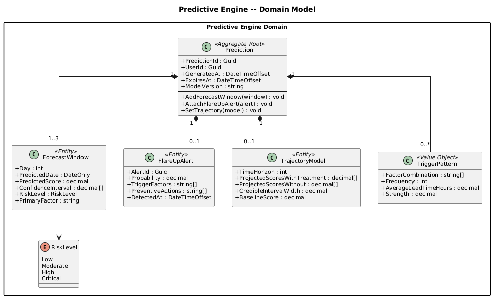
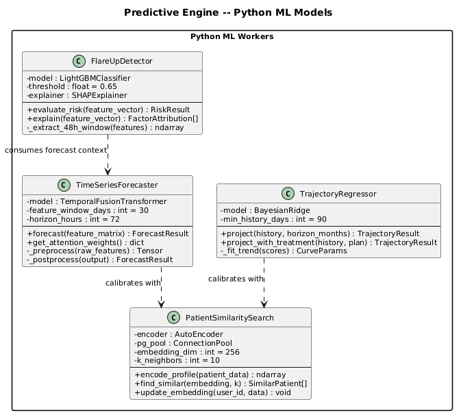
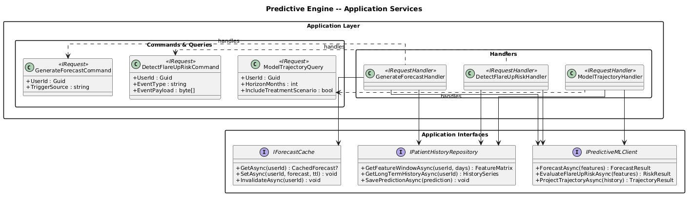
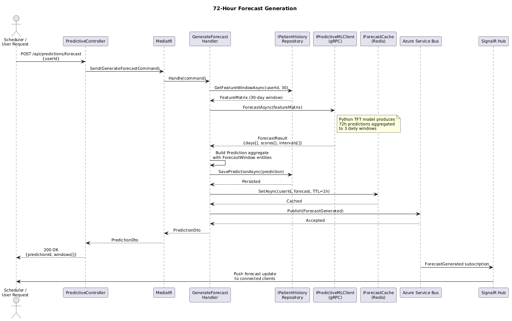
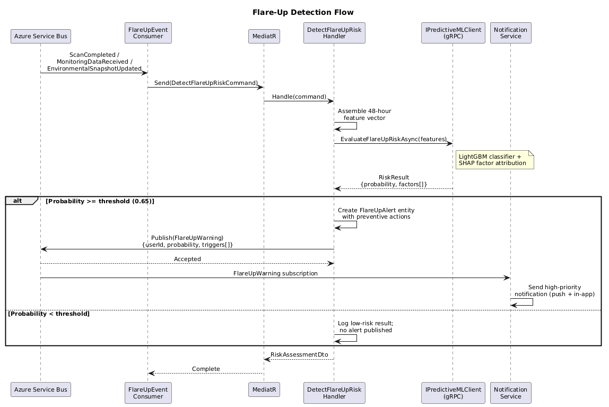
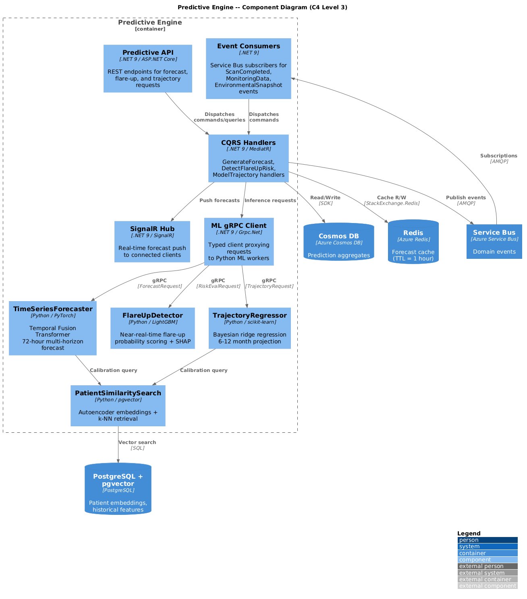

# Predictive Engine -- Detailed Design

## Overview

The Predictive Engine bounded context is responsible for forward-looking ocular health intelligence. It consumes historical scan data, environmental snapshots, passive monitoring metrics, and diagnostic results to produce actionable predictions: 72-hour symptom forecasts, flare-up probability alerts, long-term trajectory models (6--12 months), and trigger pattern identification. The context runs as a hybrid .NET 9 orchestration layer paired with Python ML workers that host Temporal Fusion Transformer models for time-series forecasting and regression models for trajectory projection.

## Responsibilities

| Responsibility | Description |
|---|---|
| **72-Hour Forecasting** | Generate a rolling 72-hour redness and symptom score forecast from a 30-day feature window of scan, monitoring, and environmental data. |
| **Flare-Up Detection** | Evaluate incoming events in near-real-time against a learned risk model; publish `FlareUpWarning` when probability exceeds a configurable threshold. |
| **Long-Term Trajectory Modeling** | Project ocular health scores over 6--12 months under two scenarios: with current treatment and without treatment. |
| **Trigger Pattern Identification** | Mine historical data to surface recurring trigger combinations (e.g., high pollen + poor sleep) that precede symptom spikes. |
| **Similar-Patient Retrieval** | Query pgvector embeddings to find patients with analogous histories, improving forecast calibration and trajectory confidence. |
| **Forecast Caching** | Cache active forecasts in Redis so downstream consumers (mobile app, clinical portal) receive sub-millisecond reads. |
| **Event Publishing** | Emit `ForecastGenerated` and `FlareUpWarning` domain events to Azure Service Bus for consumption by Notifications, Treatment Orchestration, and Clinical Portal. |

## Boundaries

| In Scope | Out of Scope |
|----------|-------------|
| Forecast generation and caching | Raw scan image capture (Scan Engine) |
| Flare-up risk scoring | Clinical diagnosis (Diagnostic Engine) |
| Trajectory projection | Treatment plan creation (Treatment Orchestration) |
| Trigger pattern mining | Alert delivery channels (Notifications & Alerts) |
| Similar-patient vector search | Environmental data collection (Environmental Context) |
| ML model inference | Model training pipelines (offline MLOps) |

## ML Model Descriptions

### Temporal Fusion Transformer (TFT) -- 72-Hour Forecaster

A multi-horizon attention-based model that ingests a 30-day sliding window of time-stamped features (redness scores, blink rates, sleep quality, AQI, pollen counts, screen time) and produces point forecasts with prediction intervals for each of the next 72 hours, aggregated to daily granularity. The TFT architecture natively handles known future inputs (weather forecasts, scheduled screen time) alongside observed past inputs.

### Flare-Up Detector

A gradient-boosted ensemble (LightGBM) trained on labeled flare-up episodes. It operates on the most recent 48-hour feature vector and outputs a probability score (0.0--1.0) with SHAP-derived factor attribution. The model is lightweight enough for near-real-time evaluation on each incoming event.

### Trajectory Regressor

A Bayesian ridge regression model that fits long-term trend curves to 90+ days of historical redness and composite health scores. It outputs projected scores at monthly intervals for 6--12 months under two treatment scenarios, along with credible intervals.

### Patient Similarity Search

A pgvector-backed nearest-neighbor retrieval system. Each patient's longitudinal profile is encoded into a 256-dimensional embedding by a shallow autoencoder. At inference time, the k nearest neighbors are retrieved to provide cohort-based calibration factors for the TFT and trajectory models.

## Domain Concepts

| Concept | Description |
|---------|-------------|
| **Prediction** | Aggregate root representing a single prediction session for a user, containing forecast windows, flare-up alerts, and trajectory models. |
| **ForecastWindow** | Entity within a Prediction representing a single day's predicted score, risk level, and primary contributing factor. |
| **FlareUpAlert** | Entity capturing the probability, trigger factors, and recommended preventive actions for an imminent flare-up. |
| **TrajectoryModel** | Entity holding 6--12 month projected scores under with-treatment and without-treatment scenarios. |
| **TriggerPattern** | Value object describing a recurring combination of factors that precede symptom spikes. |

## Integration Points

| Direction | System | Protocol | Payload |
|-----------|--------|----------|---------|
| Inbound | Scan Engine | Service Bus | ScanCompleted event |
| Inbound | Passive Monitoring | Service Bus | MonitoringDataReceived event |
| Inbound | Environmental Context | Service Bus | EnvironmentalSnapshotUpdated event |
| Inbound | Diagnostic Engine | Service Bus | DiagnosisCompleted event |
| Outbound | Azure Service Bus | AMQP | ForecastGenerated, FlareUpWarning events |
| Internal | Python ML Workers | gRPC | Forecast requests / responses |
| Internal | PostgreSQL + pgvector | SQL | Patient embeddings, similarity search |
| Internal | Redis | StackExchange.Redis | Forecast cache (read/write) |
| Internal | Cosmos DB | SDK | Prediction aggregate persistence |
| Outbound | SignalR Hub | WebSocket | Real-time forecast push to clients |

## Key Design Decisions

1. **Temporal Fusion Transformer over ARIMA/Prophet** -- TFT handles heterogeneous covariates (known future + observed past) and produces interpretable attention weights, critical for explaining predictions to clinicians.
2. **LightGBM for flare-up detection** -- Sub-10ms inference latency enables near-real-time evaluation on every incoming event without queuing.
3. **Redis forecast cache** -- Forecasts are read far more frequently than they are written; a 1-hour TTL in Redis eliminates repeated DB queries from mobile and portal clients.
4. **pgvector for similarity search** -- Embedding-based retrieval leverages PostgreSQL's existing presence in the stack, avoiding a separate vector database.
5. **gRPC between .NET and Python** -- Binary protocol minimizes serialization overhead for the dense numeric feature vectors exchanged during inference.
6. **Two-scenario trajectory modeling** -- Presenting with-treatment vs. without-treatment projections supports informed clinical decision-making and patient motivation.

## HIPAA Compliance

- All prediction data is encrypted at rest (AES-256) in Cosmos DB and PostgreSQL.
- Redis cache entries contain no directly identifying PHI; forecasts are keyed by opaque `PredictionId`.
- Audit metadata is attached to every Prediction aggregate for full access traceability.
- Patient similarity search operates on de-identified embeddings; no raw PHI is stored in the vector index.

## Diagrams

### Domain Model

### ML Model Classes

### Application Services

### 72-Hour Forecast Sequence

### Flare-Up Detection Sequence

### Component Diagram (C4 Level 3)

