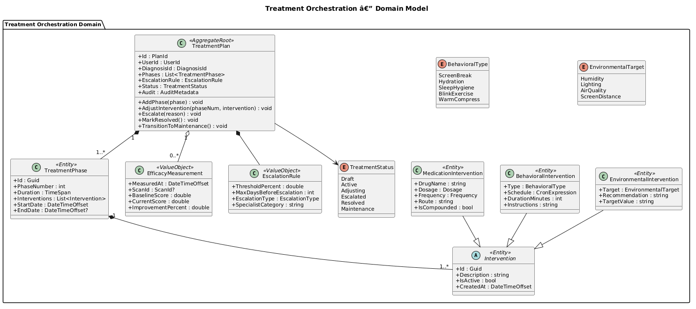
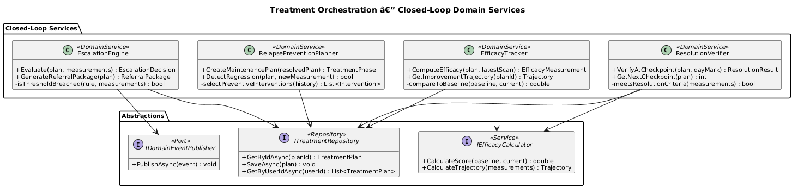
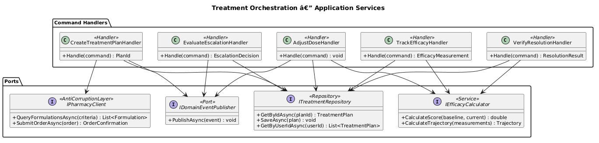
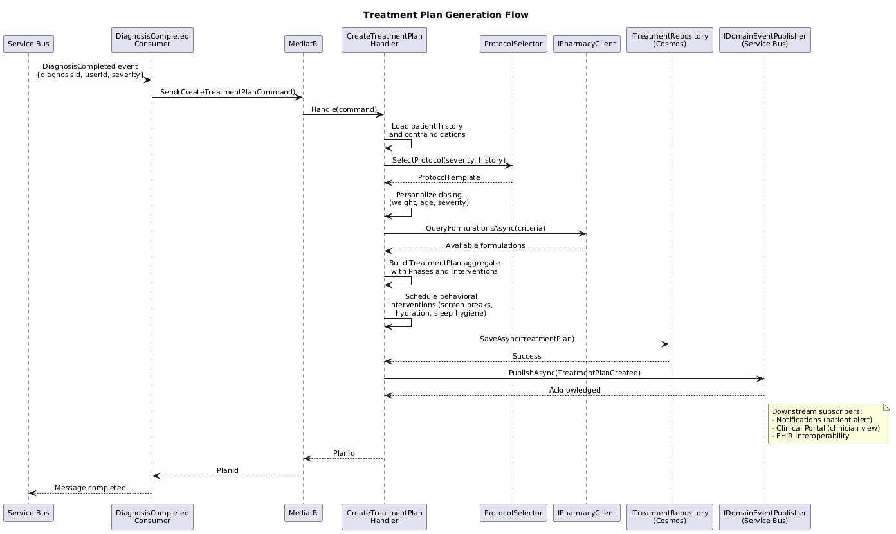
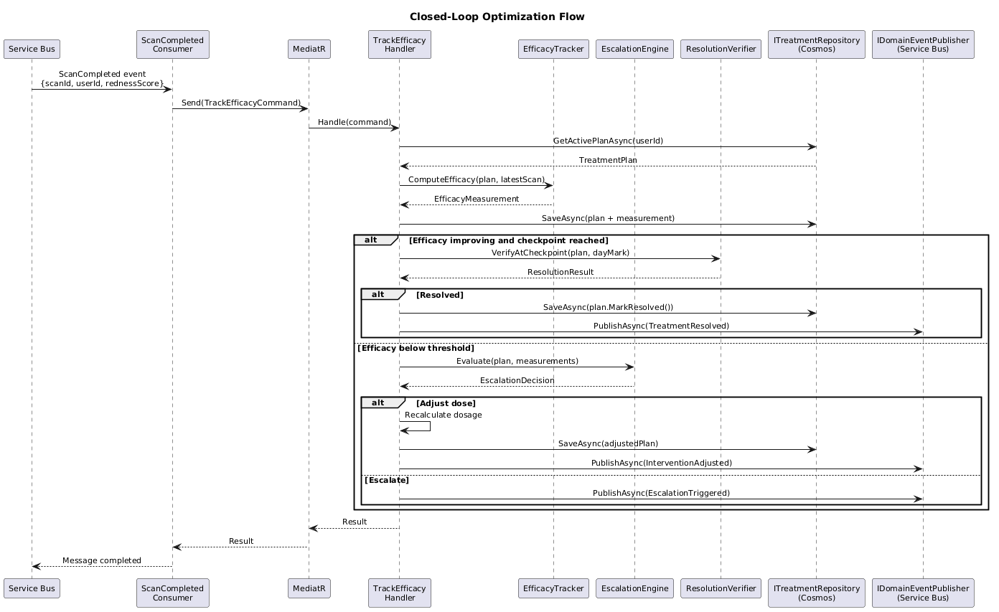
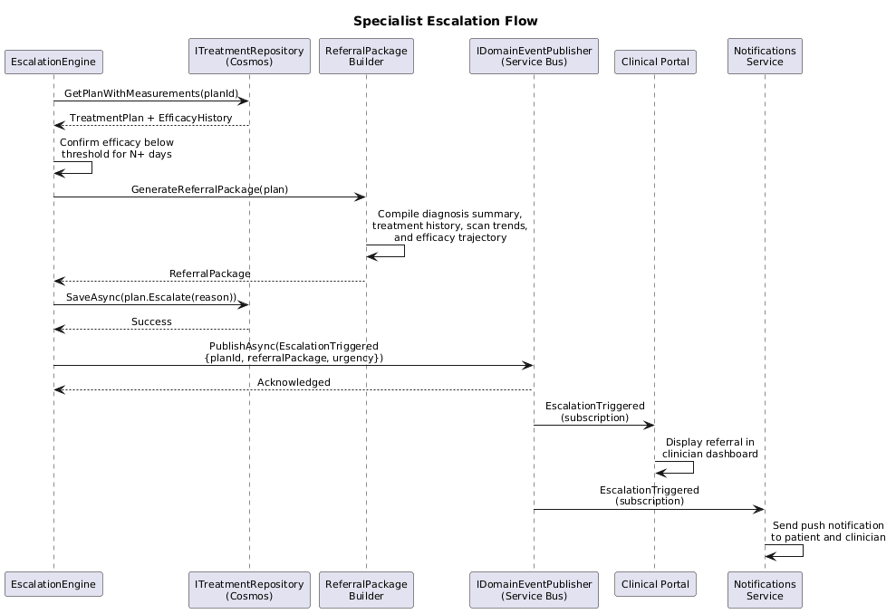
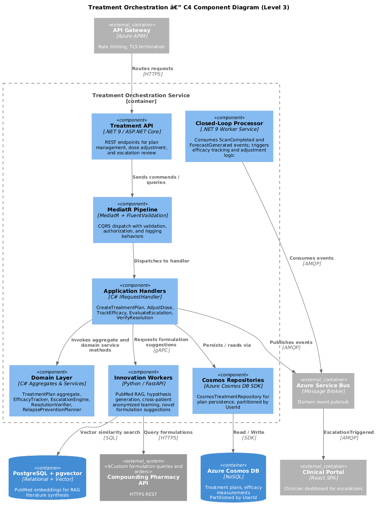

# Treatment Orchestration --- Detailed Design

## Overview

The Treatment Orchestration bounded context is the largest and most clinically impactful domain in ClearEyeQ. It spans three functional requirement groups --- FR-300 (Autonomous Treatment), FR-310 (Closed-Loop Optimization), and FR-320 (Therapeutic Innovation Engine) --- and is responsible for the complete treatment lifecycle: generating personalized treatment plans, dynamically adjusting interventions based on real-time scan and monitoring data, escalating to specialists when outcomes are insufficient, verifying resolution at 30/60/90-day checkpoints, and preventing relapse through ongoing behavioral and environmental recommendations.

A distinguishing capability is the Therapeutic Innovation Engine (FR-320), which applies RAG-based literature synthesis over PubMed embeddings to generate novel treatment hypotheses, suggest compounding pharmacy formulations, and contribute to anonymized cross-patient learning.

## Responsibilities

- **Personalized Protocol Generation** --- Upon receiving a `DiagnosisCompleted` event, assess severity, patient history, and contraindications to select and personalize a multi-phase treatment protocol.
- **Dynamic Dose Adjustment** --- Continuously recalibrate medication dosages and frequencies based on incoming scan results and monitoring data via a closed-loop feedback system.
- **Behavioral Intervention Scheduling** --- Schedule and track non-pharmacological interventions: screen breaks, hydration reminders, sleep hygiene improvements, and environmental adjustments.
- **Novel Formulation Suggestions** --- Query a compounding pharmacy API to suggest custom formulations when standard treatments are insufficient or contraindicated.
- **Efficacy Tracking** --- Compute efficacy scores by comparing current scan/monitoring metrics against plan baselines, tracking improvement trajectories over time.
- **Escalation to Specialist** --- When efficacy thresholds are not met within configured timeframes, generate a referral package and trigger specialist escalation.
- **30/60/90-Day Resolution Verification** --- Evaluate treatment outcomes at standard checkpoints to confirm resolution or recommend plan continuation/modification.
- **Relapse Prevention** --- After resolution, maintain a lightweight monitoring and behavioral plan to detect early regression signals.
- **Cross-Patient Anonymized Learning** --- Aggregate de-identified treatment outcome data to improve protocol selection for future patients.
- **Hypothesis Generation & Literature Synthesis** --- Use RAG over PubMed vector embeddings to surface relevant research findings and generate novel therapeutic hypotheses.
- **Event Publishing** --- Emit `TreatmentPlanCreated`, `InterventionAdjusted`, and `EscalationTriggered` domain events to Azure Service Bus for downstream consumption.

## Boundaries

| In Scope | Out of Scope |
|----------|-------------|
| Treatment plan generation and personalization | Clinical diagnosis (Diagnostic Engine) |
| Dose adjustment and intervention scheduling | Image capture and scoring (Scan Engine) |
| Efficacy tracking and resolution verification | Passive biometric monitoring (Passive Monitoring) |
| Specialist escalation and referral packaging | Predictive forecasting (Predictive Engine) |
| Compounding pharmacy API integration | Push notification delivery (Notifications & Alerts) |
| PubMed RAG and hypothesis generation | Billing and subscription gating (Subscription & Billing) |
| Cross-patient anonymized outcome learning | FHIR export (FHIR Interoperability) |

## Treatment Lifecycle

1. **Plan Creation** --- A `DiagnosisCompleted` event triggers assessment of severity, patient history, and available therapies. A multi-phase `TreatmentPlan` is generated and persisted.
2. **Active Treatment** --- The patient follows the prescribed interventions (medication, behavioral, environmental). The system sends reminders and tracks adherence.
3. **Closed-Loop Monitoring** --- Each incoming `ScanCompleted` or `ForecastGenerated` event triggers efficacy computation. Dose or schedule adjustments are made automatically when warranted.
4. **Escalation** --- If efficacy remains below threshold after the configured number of days, the system generates a referral package and publishes `EscalationTriggered`.
5. **Resolution Verification** --- At 30-, 60-, and 90-day checkpoints, the system evaluates whether the condition has resolved. Successful resolution transitions the plan to maintenance mode.
6. **Relapse Prevention** --- A maintenance phase with reduced-frequency monitoring and behavioral reminders continues after resolution to detect early regression.

## Domain Concepts

| Concept | Description |
|---------|-------------|
| **TreatmentPlan** | Aggregate root representing a complete treatment program for a diagnosed condition. |
| **TreatmentPhase** | A time-bounded stage within a plan, containing a set of interventions. |
| **Intervention** | Abstract base for a therapeutic action: medication, behavioral, or environmental. |
| **MedicationIntervention** | A pharmacological intervention with drug name, dosage, and frequency. |
| **BehavioralIntervention** | A non-pharmacological intervention such as screen breaks or sleep hygiene. |
| **EnvironmentalIntervention** | A recommendation targeting the patient's environment (humidity, lighting). |
| **EfficacyMeasurement** | Value object capturing a point-in-time efficacy score against the plan baseline. |
| **EscalationRule** | Value object encoding the threshold, timeframe, and action for specialist escalation. |
| **TreatmentStatus** | Lifecycle enum: Draft, Active, Adjusting, Escalated, Resolved, Maintenance. |

## Integration Points

| Direction | System | Protocol | Payload |
|-----------|--------|----------|---------|
| Inbound | Diagnostic Engine | Service Bus | DiagnosisCompleted event |
| Inbound | Scan Engine | Service Bus | ScanCompleted event |
| Inbound | Predictive Engine | Service Bus | ForecastGenerated event |
| Outbound | Azure Service Bus | AMQP | TreatmentPlanCreated, InterventionAdjusted, EscalationTriggered |
| Outbound | Compounding Pharmacy API | HTTPS REST | Formulation queries and orders |
| Outbound | Notifications & Alerts | Service Bus | Patient and clinician notifications |
| Outbound | Clinical Portal | Service Bus | EscalationTriggered with referral package |
| Internal | PostgreSQL + pgvector | SQL | PubMed embeddings for RAG |
| Internal | Cosmos DB | SDK | Treatment plan persistence |

## Diagrams

### Domain Model

### Closed-Loop Services

### Application Services

### Treatment Generation Sequence

### Closed-Loop Optimization Sequence

### Escalation Sequence

### C4 Component Diagram

