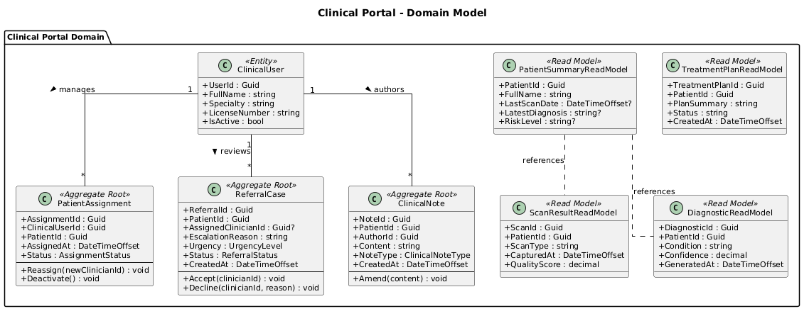
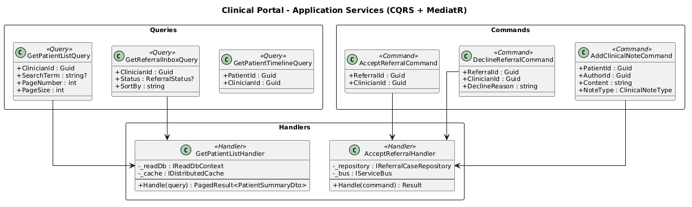
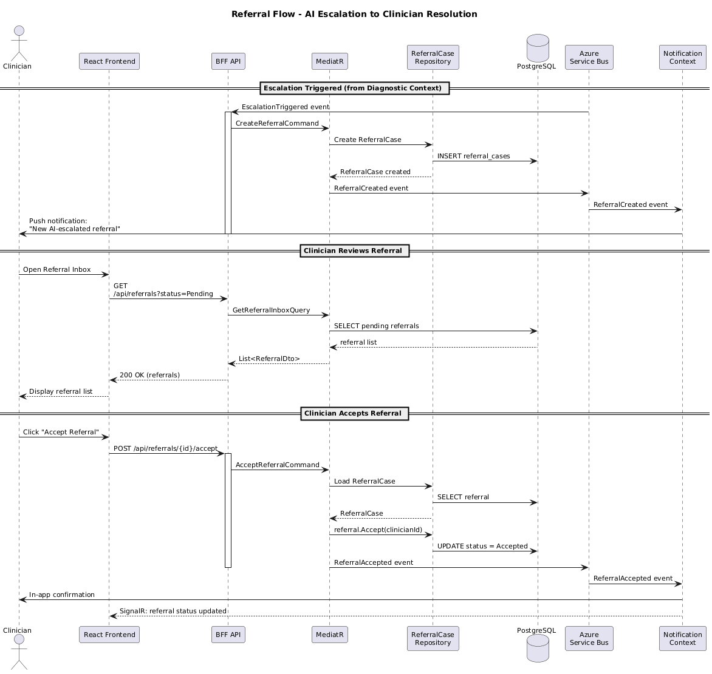
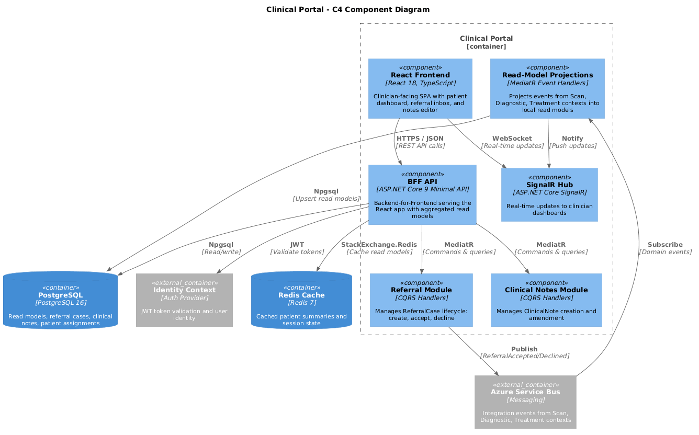

# 08 - Clinical Portal

## Purpose

The Clinical Portal is the clinician-facing web portal for ClearEyeQ. It operates primarily as a read-model/BFF (Backend for Frontend), projecting read models from the Scan, Diagnostic, and Treatment bounded contexts via Azure Service Bus event subscriptions. The context owns the **ClinicalNote** and **PatientAssignment** aggregates and provides a **Referral Inbox** for AI-escalated cases.

## Bounded Context Ownership

| Owned Aggregates       | Projected Read Models                     |
|------------------------|-------------------------------------------|
| PatientAssignment      | PatientSummaryReadModel (from Scan, Diag) |
| ReferralCase           | ScanResultReadModel (from Scan)           |
| ClinicalNote           | DiagnosticReadModel (from Diagnostic)     |
|                        | TreatmentPlanReadModel (from Treatment)   |

## Key Capabilities

- **Patient List & Dashboard** -- aggregated view of assigned patients with latest scan results, diagnostic summaries, and treatment plans.
- **Referral Inbox** -- AI-escalated cases surface here for clinician review; clinicians accept or decline referrals.
- **Clinical Notes** -- clinicians author and manage notes attached to patient encounters.
- **Read-Model Projections** -- event-driven projections keep local read models eventually consistent with upstream contexts.

## Technology Stack

| Layer          | Technology                              |
|----------------|-----------------------------------------|
| Frontend       | React 18 + TypeScript, TanStack Query   |
| BFF API        | ASP.NET Core 9 Minimal API              |
| Messaging      | Azure Service Bus (subscriptions)        |
| Read Store     | PostgreSQL                               |
| Cache          | Redis                                    |
| Real-time      | SignalR                                  |
| Auth           | Microsoft Identity, JWT Bearer           |

## Domain Model

## Application Services

## Referral Flow

## Component Diagram (C4)

## Integration Events Consumed

| Event                        | Source Context | Projection Target          |
|------------------------------|----------------|----------------------------|
| ScanCompleted                | Scan           | ScanResultReadModel        |
| DiagnosisGenerated           | Diagnostic     | DiagnosticReadModel        |
| TreatmentPlanCreated         | Treatment      | TreatmentPlanReadModel     |
| EscalationTriggered          | Diagnostic     | ReferralCase (created)     |
| PatientRegistered            | Identity       | PatientSummaryReadModel    |

## Integration Events Published

| Event                        | Description                              |
|------------------------------|------------------------------------------|
| ReferralAccepted             | Clinician accepted an AI-escalated case  |
| ReferralDeclined             | Clinician declined a referral            |
| ClinicalNoteAdded            | A new clinical note was recorded         |
