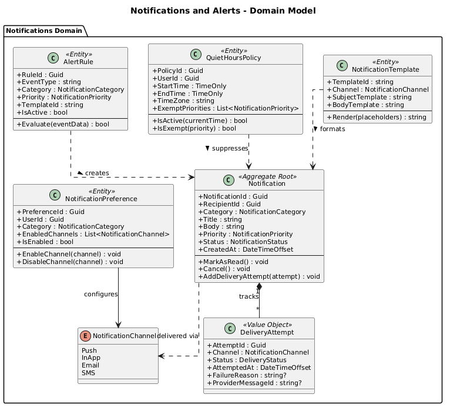
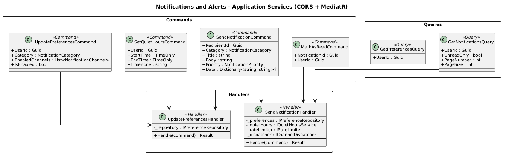
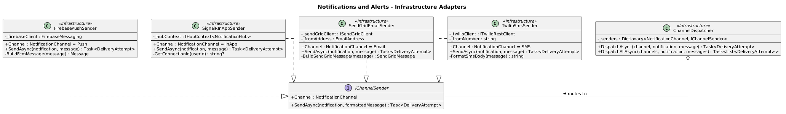
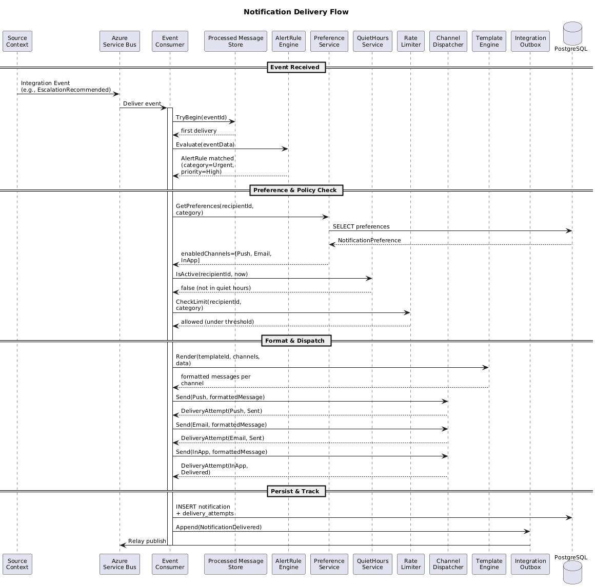
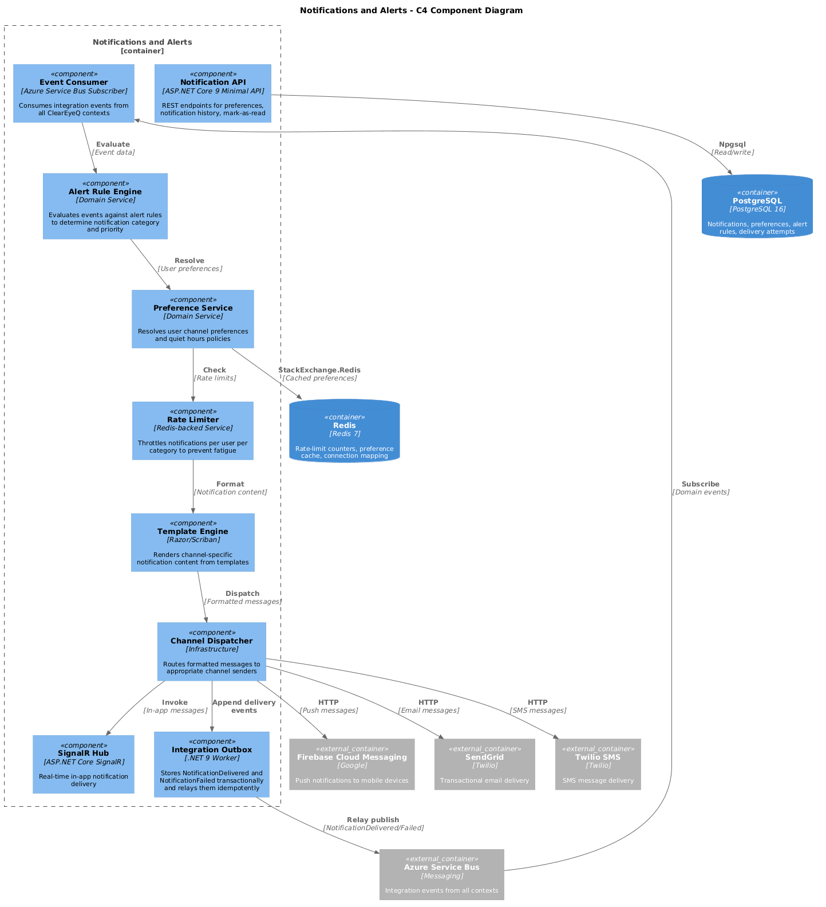

# 09 - Notifications and Alerts

## Purpose

The Notifications and Alerts bounded context provides unified notification delivery across all channels: push (FCM/APNs), in-app (SignalR), email (SendGrid), and SMS (Twilio). It manages user notification preferences, quiet hours enforcement, rate limiting, and delivery tracking. This context consumes integration events from all other ClearEyeQ bounded contexts.

## Bounded Context Ownership

| Owned Aggregates         | Description                                      |
|--------------------------|--------------------------------------------------|
| Notification             | Core aggregate representing a notification unit   |
| NotificationPreference   | Per-user channel and category preferences         |
| AlertRule                | Configurable rules that trigger notifications     |
| DeliveryAttempt          | Tracks each delivery attempt per channel          |
| QuietHoursPolicy         | Time-window suppression rules per user            |

## Key Capabilities

- **Multi-Channel Delivery** -- routes notifications to push, in-app, email, and SMS based on user preferences and alert priority.
- **Preference Management** -- users control which categories they receive and via which channels.
- **Quiet Hours** -- suppress non-critical notifications during user-defined quiet windows.
- **Rate Limiting** -- prevents notification fatigue by throttling per-user, per-category delivery.
- **Delivery Tracking** -- records every attempt with status (sent, delivered, failed, bounced) for audit and retry.
- **Template Rendering** -- channel-specific formatting using templates with dynamic placeholders.
- **Idempotent Event Consumption** -- processed-message tracking prevents duplicate notifications during retries or replay.

## Technology Stack

| Layer              | Technology                              |
|--------------------|-----------------------------------------|
| API                | ASP.NET Core 9 Minimal API              |
| Messaging          | Azure Service Bus (subscriptions)        |
| Push               | Firebase Cloud Messaging, APNs           |
| In-App             | SignalR                                  |
| Email              | SendGrid API                             |
| SMS                | Twilio API                               |
| Persistence        | PostgreSQL                               |
| Cache              | Redis (rate-limit counters, preferences) |

## Domain Model

## Application Services

## Infrastructure Adapters

## Notification Delivery Flow

## Component Diagram (C4)

## Integration Events Consumed

| Event                        | Source Context      | Notification Category   |
|------------------------------|---------------------|-------------------------|
| ScanCompleted                | Scan                | ScanResult              |
| DiagnosisCompleted           | Diagnostic          | DiagnosticResult        |
| EscalationRecommended        | Treatment           | UrgentAlert             |
| TreatmentPlanActivated       | Treatment           | TreatmentUpdate         |
| InterventionAdjusted         | Treatment           | TreatmentUpdate         |
| ReferralAccepted             | Clinical Portal     | ReferralStatus          |
| SubscriptionChanged          | Subscription        | BillingAlert            |
| PaymentFailed                | Subscription        | BillingAlert            |
| AppointmentReminder          | Scheduling          | Reminder                |

## Integration Events Published

| Event                        | Description                              |
|------------------------------|------------------------------------------|
| NotificationDelivered        | Notification successfully delivered       |
| NotificationFailed           | All delivery attempts exhausted           |
