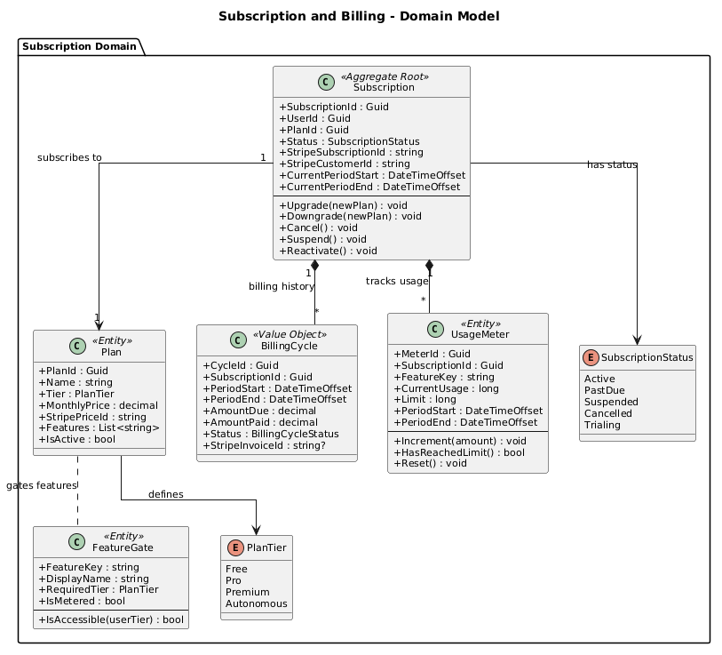
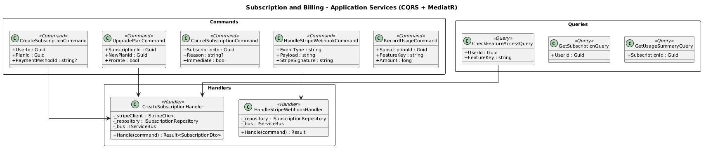
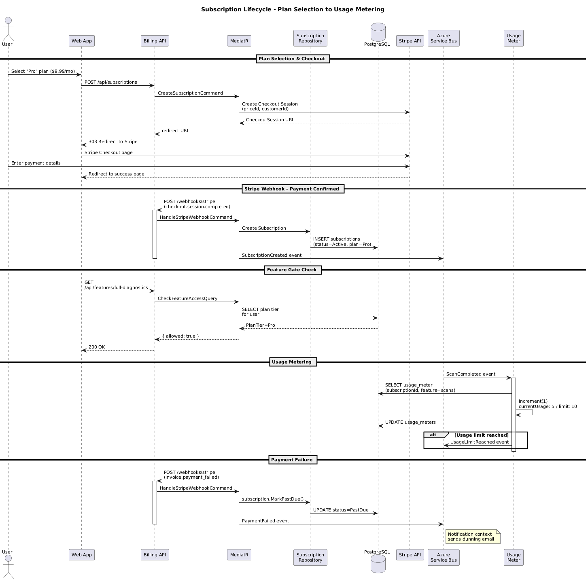
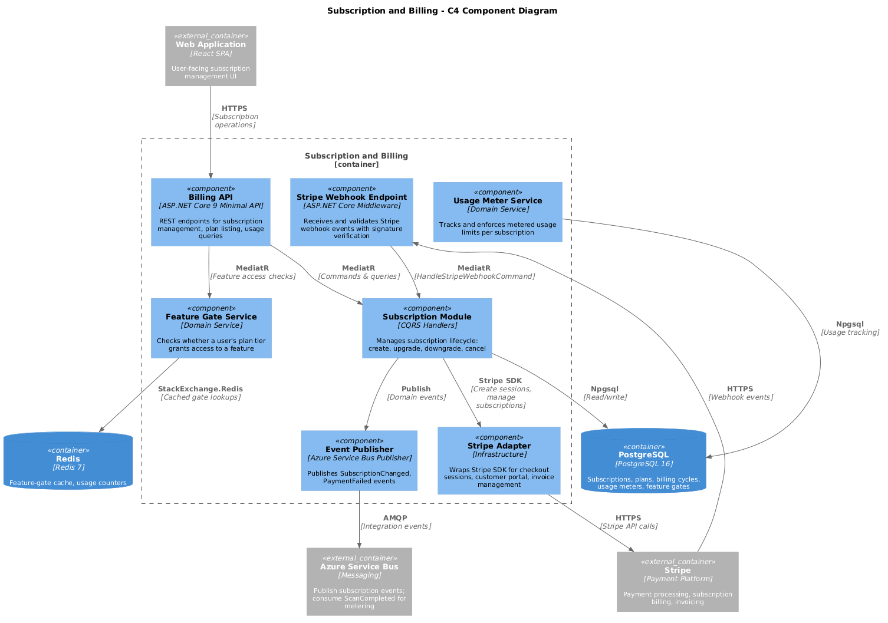

# 10 - Subscription and Billing

## Purpose

The Subscription and Billing bounded context manages plan lifecycle, payment processing via Stripe, feature gating, and usage metering. It supports four subscription tiers (Free, Pro, Premium, Autonomous) and publishes SubscriptionChanged events consumed by other contexts for feature-access enforcement.

## Subscription Plans

| Plan         | Price/Month | Key Features                                      |
|--------------|-------------|---------------------------------------------------|
| Free         | $0.00       | 1 scan/month, basic results, community support     |
| Pro          | $9.99       | 10 scans/month, full diagnostics, email support    |
| Premium      | $29.99      | Unlimited scans, treatment plans, priority support |
| Autonomous   | $99.99      | Autonomous monitoring, API access, dedicated CSM   |

## Bounded Context Ownership

| Owned Aggregates    | Description                                      |
|---------------------|--------------------------------------------------|
| Subscription        | Core aggregate: plan, status, billing cycle       |
| Plan                | Defines tier, pricing, included features          |
| BillingCycle        | Tracks current period, renewal, proration         |
| FeatureGate         | Maps features to required plan tiers              |
| UsageMeter          | Tracks metered usage (scans, API calls)           |

## Key Capabilities

- **Plan Management** -- CRUD for subscription plans with feature definitions.
- **Subscription Lifecycle** -- create, upgrade, downgrade, cancel, reactivate.
- **Stripe Integration** -- Checkout Sessions, Customer Portal, webhook processing.
- **Feature Gating** -- real-time checks whether a user's plan includes a given feature.
- **Usage Metering** -- tracks scan counts, API calls, and storage against plan limits.
- **Payment Failure Handling** -- grace period, dunning emails, eventual suspension.

## Technology Stack

| Layer              | Technology                              |
|--------------------|-----------------------------------------|
| API                | ASP.NET Core 9 Minimal API              |
| Payments           | Stripe API (Checkout, Billing Portal)    |
| Persistence        | PostgreSQL                               |
| Cache              | Redis (feature-gate lookups)             |
| Messaging          | Azure Service Bus (publish events)       |

## Domain Model

## Application Services

## Subscription Lifecycle Flow

## Component Diagram (C4)

## Integration Events Published

| Event                        | Description                                  |
|------------------------------|----------------------------------------------|
| SubscriptionCreated          | New subscription activated                    |
| SubscriptionChanged          | Plan upgrade/downgrade completed              |
| SubscriptionCancelled        | Subscription cancelled (end of period)        |
| SubscriptionSuspended        | Suspended due to payment failure              |
| PaymentSucceeded             | Successful payment processed                  |
| PaymentFailed                | Payment attempt failed                        |
| UsageLimitReached            | User hit metered usage cap                    |

## Integration Events Consumed

| Event                        | Source Context | Action                       |
|------------------------------|----------------|------------------------------|
| ScanCompleted                | Scan           | Increment usage meter         |
| PatientRegistered            | Identity       | Provision free-tier sub       |
