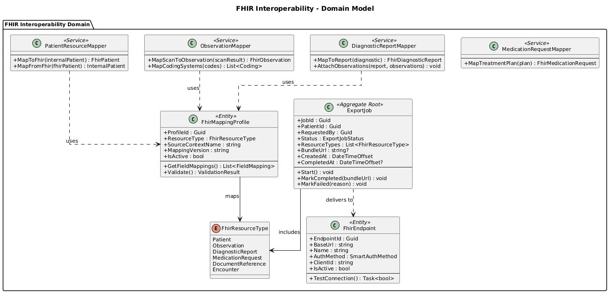
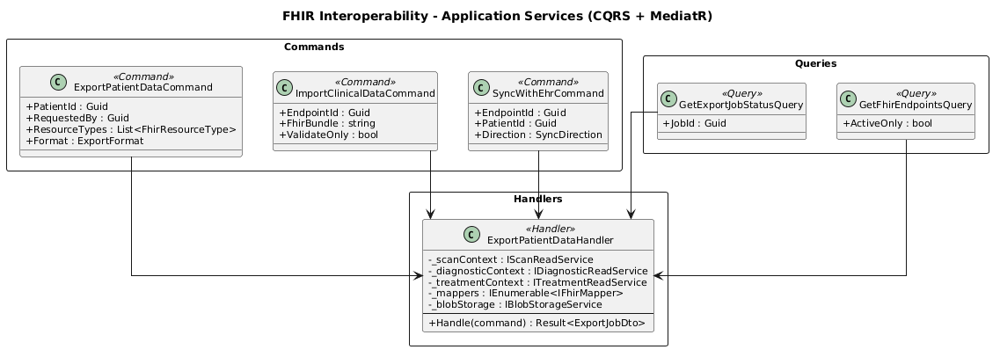
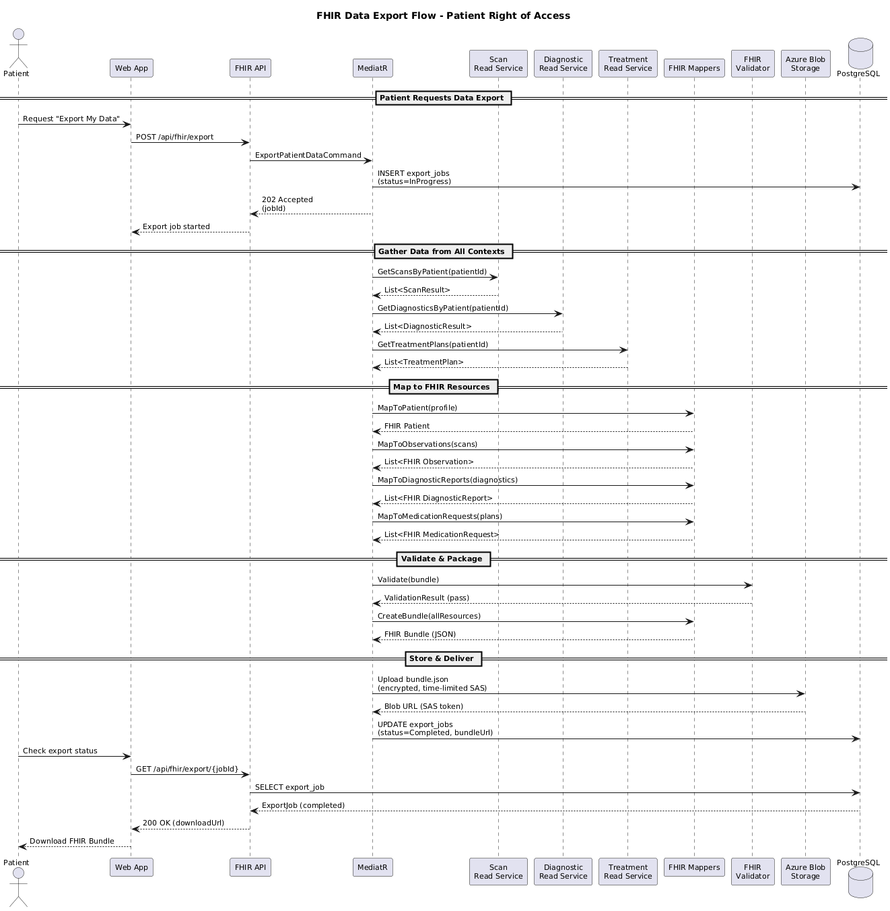
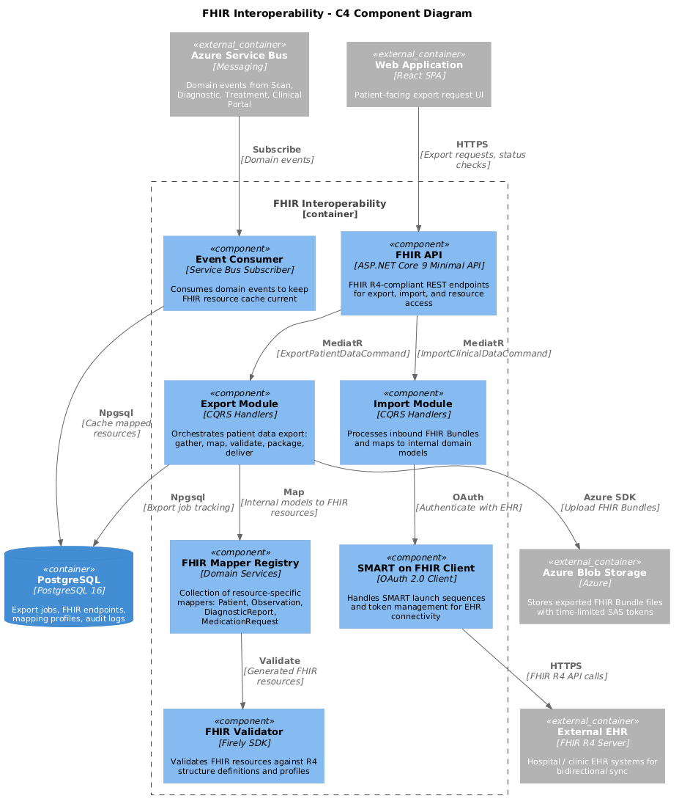

# 11 - FHIR Interoperability

## Purpose

The FHIR Interoperability bounded context serves as the translation layer between ClearEyeQ internal domain models and HL7 FHIR R4 resources. It supports data export for HIPAA right-of-access compliance, EHR synchronization via SMART on FHIR, and bidirectional clinical data exchange with external health systems.

## FHIR Resource Mappings

| Internal Model         | FHIR R4 Resource     | Direction       |
|------------------------|----------------------|-----------------|
| Patient profile        | Patient              | Bidirectional   |
| Scan result            | Observation          | Export          |
| Diagnostic report      | DiagnosticReport     | Export          |
| Treatment plan         | MedicationRequest    | Export          |
| Clinical note          | DocumentReference    | Bidirectional   |
| Encounter              | Encounter            | Export          |

## Bounded Context Ownership

| Owned Entities          | Description                                       |
|-------------------------|---------------------------------------------------|
| FhirMappingProfile      | Configurable mapping rules per resource type       |
| PatientResourceMapper   | Maps internal patient to FHIR Patient              |
| ObservationMapper       | Maps scan results to FHIR Observation              |
| DiagnosticReportMapper  | Maps diagnostics to FHIR DiagnosticReport          |
| ExportJob               | Tracks bulk export requests and progress            |
| FhirEndpoint            | Registered external FHIR server endpoints           |

## Key Capabilities

- **FHIR R4 Translation** -- maps internal domain events and models to standards-compliant FHIR resources.
- **Patient Data Export** -- HIPAA right-of-access: patients can request a complete FHIR Bundle of their data.
- **EHR Sync** -- bidirectional sync with external EHR systems via SMART on FHIR OAuth2 flows.
- **Bulk Export** -- async FHIR $export operation for large datasets.
- **Validation** -- validates generated FHIR resources against R4 profiles before transmission.
- **Audit Trail** -- logs all data access and export operations for compliance.

## Technology Stack

| Layer              | Technology                                  |
|--------------------|---------------------------------------------|
| API                | ASP.NET Core 9 Minimal API (FHIR endpoints) |
| FHIR Library       | Firely SDK (Hl7.Fhir.R4)                    |
| Auth (SMART)       | OAuth 2.0 / OpenID Connect                   |
| Persistence        | PostgreSQL                                    |
| Blob Storage       | Azure Blob Storage (export bundles)           |
| Messaging          | Azure Service Bus (consume domain events)     |

## Domain Model

## Application Services

## Data Export Flow

## Component Diagram (C4)

## Integration Events Consumed

| Event                        | Source Context   | Action                          |
|------------------------------|------------------|---------------------------------|
| ScanCompleted                | Scan             | Map to Observation              |
| DiagnosisGenerated           | Diagnostic       | Map to DiagnosticReport         |
| TreatmentPlanCreated         | Treatment        | Map to MedicationRequest        |
| ClinicalNoteAdded            | Clinical Portal  | Map to DocumentReference        |
| PatientRegistered            | Identity         | Map to Patient resource         |

## Integration Events Published

| Event                        | Description                                  |
|------------------------------|----------------------------------------------|
| ExportJobCompleted           | Patient data export bundle ready              |
| ExportJobFailed              | Export job encountered an error               |
| FhirSyncCompleted            | EHR sync cycle completed successfully         |
| ClinicalDataImported         | External data imported into ClearEyeQ         |
