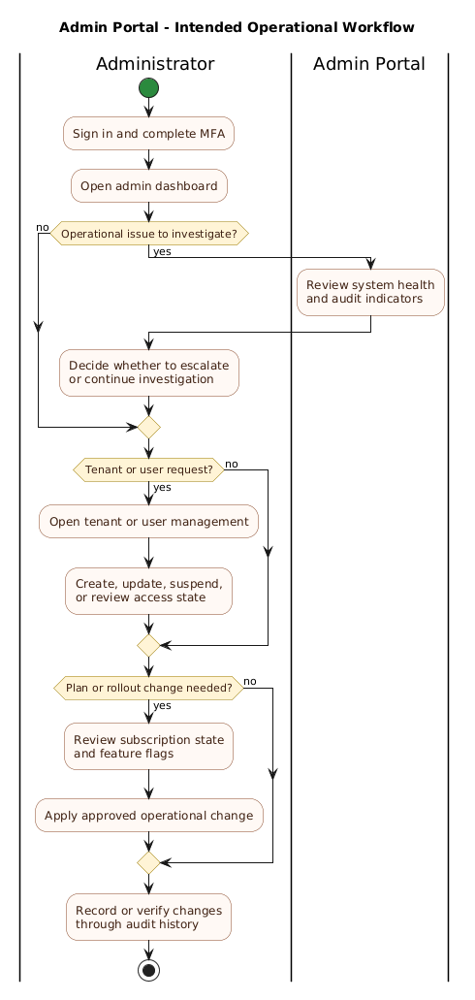

# Admin Portal User Guide

> [!NOTE]
> This guide reflects the current designed responsibilities of the ClearEyeQ Admin Portal. It documents the intended operational workflow for platform administrators based on the requirements and architecture in this repository.

## Purpose

The Admin Portal is the internal administrative application for ClearEyeQ. It is designed to give authorized administrators operational control over tenants, users, subscriptions, system health, feature flags, and audit visibility across the platform while preserving tenant isolation and compliance controls.

## Who This Guide Is For

- Internal ClearEyeQ platform administrators
- Operations and support leads managing tenants and access
- Compliance and platform teams reviewing audit or system state

## Access Requirements

Admin access is designed to require:

- An `Admin` role account
- MFA enrollment and successful MFA at sign-in
- Desktop-class browser access
- Use within an approved administrative environment

### Important Layout Constraint

The current product requirements define the Admin Portal as desktop-oriented. It is not intended to be a mobile-first interface.

## Main Areas Of The Portal

| Area | Primary Purpose |
|---|---|
| Tenants | Provision and manage organizational boundaries |
| Users | Manage access, role assignment, and account state |
| Subscriptions | Review plan distribution, billing state, and usage posture |
| System health | Monitor service status, error rates, and environment health |
| Feature flags | Control rollout and availability of platform capabilities |
| Audit | Inspect privileged actions and operational history |

## Signing In

The expected sign-in flow is:

1. Open the Admin Portal URL.
2. Authenticate with your admin credentials.
3. Complete MFA verification.
4. Land on the administrative dashboard.

### Security Expectations

Administrators should expect:

- Tight session controls
- Explicit role checks
- Audit logging for privileged actions
- Strong tenant-scope validation when viewing or mutating data

## Tenant Management

Tenant management is one of the primary responsibilities of the portal.

### Typical Actions

- Create a new tenant
- View tenant metadata and status
- Update tenant-level settings
- Suspend or reactivate a tenant where policy allows

### When To Use Tenant Management

Use this area when:

- Onboarding a new customer organization
- Investigating tenant-specific configuration issues
- Coordinating lifecycle changes with support, billing, or compliance teams

## User And Role Management

The user area is intended to help administrators control who can access ClearEyeQ and at what privilege level.

### Typical Actions

- Invite a new clinician or admin user
- Assign or change roles
- Suspend or reactivate an account
- Review account status during access incidents

### Role Model

The designed platform role model includes:

- Patient
- Clinician
- Admin

Administrators should take extra care before expanding admin access or changing clinician permissions tied to PHI access.

## Subscription Oversight

The Admin Portal is intended to provide operational oversight into subscription and billing posture.

### Expected Tasks

- Review current plan mix across tenants
- Inspect billing health signals
- Understand which feature set a tenant should receive
- Coordinate plan-related issues with subscription and billing workflows

### Relevant Plan Tiers In Current Requirements

- Free
- Pro
- Premium
- Autonomous

### Common Use Cases

- Confirm whether a tenant should have access to premium capabilities
- Check whether usage or payment issues are affecting access
- Support plan migration or plan correction workflows

## System Health Monitoring

The Admin Portal is also intended to act as an operational visibility surface.

### Expected Monitoring Views

- Service availability
- Error rates
- Possibly environment or integration status, depending on final implementation

### How Admins Use This Area

- Detect a platform issue before it spreads
- Narrow investigation to a service or environment
- Provide context during incident response

## Feature Flag Management

Feature flag controls are intended to allow controlled rollout of new or risky functionality.

### Typical Actions

- Enable a feature for a subset of tenants
- Disable a feature quickly if an issue is discovered
- Coordinate staged rollout between environments or customer groups

### Recommended Operating Approach

- Use flags for progressive rollout, not permanent configuration drift
- Record why a flag changed and who approved it
- Coordinate with engineering and support teams for safety-sensitive flags

## Audit And Operational History

Because ClearEyeQ handles sensitive health workflows, audit visibility is a core part of administration.

### Expected Audit Use Cases

- Review authentication events
- Inspect privileged user actions
- Support compliance review
- Reconstruct administrative changes during an incident

### Good Administrative Practice

- Use the audit view when investigating unexpected changes
- Record supporting context in incident or support workflows outside the portal when needed
- Avoid making speculative or unexplained privilege changes

## Suggested Daily Operational Workflow

1. Sign in and confirm no critical system alerts are active.
2. Review service status or operational dashboard indicators.
3. Work through tenant or user support requests.
4. Check subscription or plan-related exceptions.
5. Review feature flag state if a rollout is in progress.
6. Use the audit surface to confirm or investigate privileged changes.

## Troubleshooting

### If A Tenant Cannot Access Expected Features

- Confirm the tenant is active
- Review the assigned subscription tier
- Check feature flag state
- Confirm there is no environment-specific rollout restriction

### If A User Cannot Sign In

- Review account status
- Confirm role assignment
- Check whether MFA enrollment or session policy is blocking access

### If A Service Appears Unhealthy

- Inspect system health indicators
- Compare the issue across tenants to determine scope
- Escalate to engineering or incident response if the problem is platform-wide

### If An Administrative Change Looks Incorrect

- Review recent audit entries
- Confirm who made the change and in what tenant context
- Avoid making compensating edits until the root cause is clear

## Security, Privacy, And Compliance Boundaries

- Admin access is highly privileged and should be tightly controlled.
- Administrative actions are expected to be auditable.
- Tenant isolation remains a hard requirement even for platform operations.
- Admin workflows should support HIPAA-aligned access control, session management, and audit behavior.

## Related Design References

- [L1 requirements](../specs/L1.md)
- [L2 requirements](../specs/L2.md)
- [System architecture overview](../detailed-design/00-system-architecture/overview.md)
- [Identity and access design](../detailed-design/01-identity-and-access/overview.md)
- [Subscription and billing design](../detailed-design/10-subscription-and-billing/overview.md)
- [Repository structure target](../repository-structure.md)
