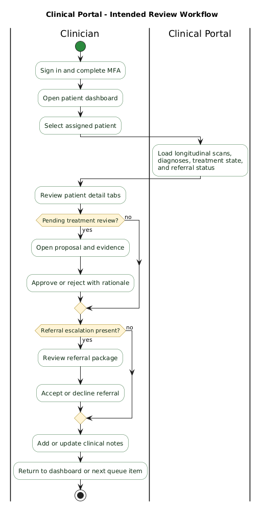

# Clinical Portal User Guide

> [!NOTE]
> This guide describes the intended clinician workflow defined by the current ClearEyeQ product and architecture documentation. The guide is aligned to the designed portal behavior and governance model, which may continue to evolve during implementation.

## Purpose

The Clinical Portal is the clinician-facing ClearEyeQ web application. It is designed to help licensed clinical staff review patient histories, inspect AI-generated diagnostic and predictive outputs, approve or reject treatment proposals, manage escalation and referral cases, and record clinical notes inside a tenant-scoped, audited environment.

## Who This Guide Is For

- Clinicians assigned to patient review and treatment supervision
- Clinical operations staff supporting referral triage
- Internal teams validating clinician workflows and review gates

## Access Requirements

Portal access is designed to require:

- A clinician account provisioned within the correct tenant
- Successful authentication through the ClearEyeQ identity system
- MFA enrollment and verification before privileged access
- A supported desktop or tablet browser, depending on final rollout policy

## Main Areas Of The Portal

| Area | Primary Purpose |
|---|---|
| Patient dashboard | Review assigned patients and priority work |
| Patient detail view | Inspect longitudinal scans, diagnoses, treatments, and notes |
| Treatment review queue | Approve or reject proposed plans and medication-affecting changes |
| Referral inbox | Review escalated cases and referral packages |
| Clinical notes | Record observations, rationale, and care decisions |
| Real-time updates | Receive live changes for referrals and review tasks |

## Signing In

The expected sign-in path is:

1. Open the Clinical Portal URL for your tenant environment.
2. Enter your credentials or use the configured identity provider.
3. Complete MFA verification.
4. Land on the patient dashboard or assigned work queue.

### Session And Security Expectations

The designed platform security model includes:

- Short-lived access tokens
- Automatic logoff after inactivity
- Tenant-scoped data isolation
- Audit logging of privileged access and review actions

## Working From The Patient Dashboard

The patient dashboard is intended to function as the clinician's command center.

### Typical Information Shown

- Patient list with latest scan date
- Current redness or status summary
- Flagged cases
- Pending referrals
- Search and filtering controls

### Typical Daily Workflow

1. Review summary metrics at the top of the dashboard.
2. Filter by flagged, urgent, or recently updated patients.
3. Open a patient record from the list.
4. Move into deeper review or approval tasks as needed.

## Reviewing A Patient Record

The patient detail view is designed to aggregate the most relevant information across the platform.

### Expected Sections

- Overview
- Scans
- Diagnosis
- Treatment

### What To Review In Each Section

#### Overview

Use the overview to establish context:

- Latest scan result
- Current plan status
- Recent alerts
- Referral or escalation state

#### Scans

Use the scan area to assess longitudinal change:

- Scan history gallery
- Comparative changes over time
- Supporting image references and timestamps

#### Diagnosis

Use the diagnosis area to inspect:

- Differential diagnosis outputs
- Confidence levels
- Contributing factors or causal graph views
- Supporting evidence synthesized from upstream contexts

#### Treatment

Use the treatment area to review:

- Active plan or pending proposal
- Phase progression
- Efficacy tracking
- Planned adjustments or escalations

## Treatment Review Workflow

One of the portal's core responsibilities is acting as the human review boundary for high-impact clinical decisions.

### What Enters The Review Queue

The queue is intended to receive:

- Proposed treatment plans
- Proposed treatment adjustments
- Medication-affecting changes
- Safety-sensitive escalation recommendations requiring clinician decision

### How To Review A Proposal

1. Open the review task from the queue.
2. Read the proposed intervention or change.
3. Review the evidence, rationale, severity, and contraindication checks.
4. Confirm whether the recommendation is appropriate for the patient context.
5. Approve or reject the proposal.
6. Record rationale, especially for rejections or exceptions.

### Important Governance Rule

The designed safety model requires clinician approval for medication initiation, discontinuation, dose change, compounding suggestions, and specialist escalation decisions before they become active.

## Referral Inbox Workflow

Escalated cases are expected to appear in a dedicated referral inbox.

### What A Referral Item May Include

- Patient summary
- Urgency level
- Triggering condition or threshold breach
- Timestamp
- Supporting rationale or referral package

### Expected Actions

- Accept the referral
- Decline the referral
- Review supporting detail first
- Record the reason for the decision

## Writing And Managing Clinical Notes

The portal is intended to support clinician-authored notes attached to patient encounters or reviews.

### Common Use Cases

- Record reasoning for a treatment approval or rejection
- Document follow-up instructions
- Capture observation after reviewing scan history or trends
- Add context to a referral decision

### Good Note Hygiene

- Be specific about the observed issue
- Tie the note to the patient context and date
- Record explicit rationale when overruling or modifying AI suggestions

## Real-Time Updates And Notifications

The portal design includes live update behavior for operationally important events.

### Examples

- Referral inbox updates
- New or changed treatment review tasks
- Notification that a patient record received a new scan or result projection

This is intended to reduce stale review state and allow faster triage for urgent cases.

## Audit, Privacy, And Tenant Boundaries

Clinical use of the portal is expected to occur within a strict security model.

### Key Principles

- Every user action is tied to role and tenant scope
- PHI access is auditable
- Cross-tenant access should be blocked at every layer
- Session and access behavior is governed by the identity system

### What Clinicians Should Expect

- Access only to patients within their authorized tenant and assignment model
- Audit visibility for major privileged actions
- Stronger security controls than patient-facing applications, including MFA

## Troubleshooting

### If A Patient Is Missing From The Dashboard

- Confirm you are signed into the correct tenant
- Check assignment or filter state
- Refresh the patient list if projections may have updated recently

### If A Review Task Looks Incomplete

- Open the patient detail view to compare upstream results
- Check whether the projection or related event is still processing
- Reload the queue and confirm the task status

### If Real-Time Updates Stop

- Refresh the browser session
- Re-authenticate if your session has expired
- Confirm there is no browser extension or network policy blocking web sockets

### If Access Is Denied Unexpectedly

- Confirm your role and tenant assignment
- Verify MFA enrollment and recent authentication status
- Escalate to an admin if a permission or account-state issue is suspected

## Safety And Operational Boundaries

- The portal is intended for clinician-supervised decision support.
- AI outputs are expected to assist, not replace, licensed clinical judgment.
- High-risk actions are intentionally gated by review and audit requirements.
- Clinicians remain responsible for final patient-facing care decisions.

## Related Design References

- [L1 requirements](../specs/L1.md)
- [L2 requirements](../specs/L2.md)
- [System architecture overview](../detailed-design/00-system-architecture/overview.md)
- [Identity and access design](../detailed-design/01-identity-and-access/overview.md)
- [Clinical portal design](../detailed-design/08-clinical-portal/overview.md)
- [Treatment orchestration design](../detailed-design/07-treatment-orchestration/overview.md)
- [Predictive engine design](../detailed-design/06-predictive-engine/overview.md)
