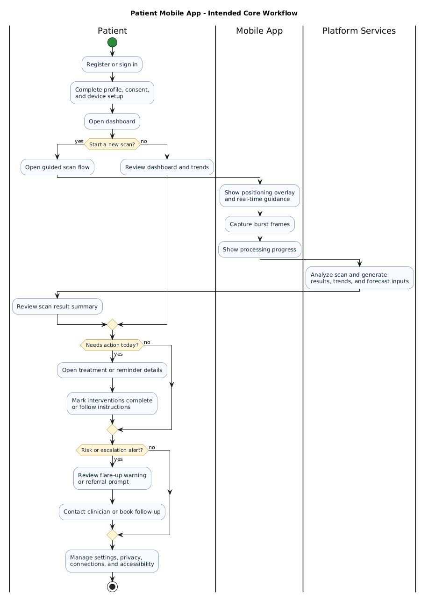

# Patient Mobile App User Guide

> [!NOTE]
> This guide describes the intended patient experience defined by the current ClearEyeQ requirements and design documents. It should be read as product guidance for the designed mobile app, not as a statement that every feature is already production-ready in this repository.

## Purpose

The Patient Mobile App is the patient-facing ClearEyeQ experience for iOS and Android. Its purpose is to help a patient capture guided eye scans, monitor ocular health over time, review AI-generated insights, follow clinician-supervised treatment plans, and manage settings, privacy, and connected data sources from one place.

## Who This Guide Is For

- Patients using ClearEyeQ to monitor eye symptoms over time
- Caregivers helping a patient complete setup or review alerts
- Support and product teams validating the intended patient workflow

## What You Can Do In The App

| Area | Primary Purpose |
|---|---|
| Welcome and sign-in | Create an account, authenticate, and finish profile setup |
| Home dashboard | Review eye health score, recent scan, insights, and quick actions |
| Guided scan | Capture an eye scan with AI-assisted positioning feedback |
| Timeline and trends | Review scan history, charts, and trigger correlations |
| Diagnosis and insights | See likely conditions, confidence levels, and contributing factors |
| Treatment | Follow active plans, reminders, and progress tracking |
| Alerts and forecast | Review 72-hour forecasts, flare-up warnings, and referral prompts |
| Settings and profile | Manage privacy, integrations, accessibility, export, and subscription |

## Before You Begin

You should expect the following before first use:

- A supported iPhone or Android device
- Camera access enabled for scan capture
- Network connectivity for account and cloud-backed features
- Push notifications enabled if you want reminders or urgent alerts
- Optional health integrations such as Apple Health, Google Fit, Oura, or similar sources, depending on what your tenant enables

## First-Time Setup

### 1. Create Or Access Your Account

The designed onboarding flow supports:

- Email and password sign-up
- Apple sign-in
- Google sign-in
- Standard login for returning users

During onboarding, the app may ask for:

- Name and profile details
- Camera permission for scan capture
- Notification permission for reminders and urgent alerts
- Consent selections for privacy, sharing, and optional research programs

### 2. Complete Profile Setup

The intended setup wizard includes:

- Profile photo or avatar selection
- Connection to available health and wearable services
- Notification setup
- Review of privacy and data preferences

### 3. Choose Initial Preferences

Patients should review and confirm:

- Preferred notification channels
- Accessibility settings such as text size or voice guidance
- Privacy controls for passive monitoring and data sharing
- Subscription plan status if tenant policy exposes plan management in the mobile app

## Home Dashboard

The dashboard is the main landing screen after login. It is designed to answer four questions quickly:

- How are my eyes doing right now?
- What changed since my last scan?
- Is there anything I need to do today?
- Is there anything I should be worried about soon?

### Key Dashboard Elements

#### Eye Health Score Card

This card is intended to display:

- Current eye health score
- Color-coded severity state
- Trend or delta from the previous scan

#### Recent Scan Summary

This area typically includes:

- Last scan timestamp
- Thumbnail or recent capture reference
- Redness level summary
- A `Scan Now` action

#### Environmental And Context Cards

The app may highlight factors such as:

- AQI
- Pollen
- Humidity
- UV index
- Screen time

#### Quick Actions

Expected quick actions include:

- Start a scan
- Log symptoms
- View trends
- Open the forecast

#### Daily Insight Banner

This banner is intended to surface concise guidance such as:

- Personalized eye-care tips
- Pattern summaries from your recent history
- Preventive suggestions based on triggers or treatment phase

## Capturing An Eye Scan

The guided scan is one of the core workflows in the app.

### Step-By-Step

1. Open the `Scan` action from the home screen or bottom navigation.
2. Position the device so your eye is centered inside the on-screen guide.
3. Follow real-time alignment cues from the app.
4. Hold steady while the app captures a burst of frames.
5. Wait for processing and analysis to complete.
6. Review the results summary and decide whether to view details, rescan, or share with your clinician.

### What The App Tries To Help You With

During capture, the app is designed to provide:

- Positioning guidance
- Readiness feedback before capture
- Scan progress after capture
- A comparison against a previous scan when possible

### Good Capture Practices

- Use steady lighting
- Avoid strong glare or deep shadows
- Keep the camera lens clean
- Hold still during the short capture window
- Retry if the app indicates poor alignment or low image quality

## Reviewing Results, Trends, And Insights

After a scan, the app is designed to help patients move from raw result to practical understanding.

### Results Summary

The immediate result view is expected to show:

- Redness score
- Directional change from the last scan
- Flags or badges for noteworthy findings
- Actions such as `View Details`, `Rescan`, or `Share with Doctor`

### Timeline And Trend Views

Trend screens are designed to support:

- 7-day, 30-day, 90-day, and 1-year views
- Longitudinal redness charts
- Correlation overlays for sleep, AQI, pollen, and screen time
- Insight cards that explain likely recurring trigger patterns

### Diagnosis And Root Cause Views

When diagnostic output is available, the app may show:

- Differential diagnoses ranked by confidence
- Severity indicators
- A simplified causal graph or factor flow
- Condition details and recommended next steps

## Treatment And Daily Management

When a clinician-approved plan exists, the treatment section is intended to help patients stay aligned with it.

### What You May See

- Active treatment plan overview
- Current phase and progress through the plan
- Medication, behavioral, and environmental interventions
- Completion tracking for daily actions
- Progress views comparing before and after scans

### Common Patient Actions

- Review the next recommended action
- Mark an intervention complete
- Check whether symptoms are improving
- Read plan notes or instructions
- Act on a referral recommendation if the plan escalates

### Important Safety Boundary

Treatment information in ClearEyeQ is designed as clinician-supervised decision support. Medication-affecting changes and specialist escalation decisions require clinician review and approval.

## Forecasts, Alerts, And Referrals

The mobile app is also designed to surface forward-looking or urgent information.

### 72-Hour Forecast

The forecast view may include:

- Next three days of projected symptom severity
- Main contributing factors for each day
- Risk labels that help a patient plan around triggers

### Flare-Up Alerts

When the system detects elevated short-term risk, the app may present:

- An in-app alert or modal
- Preventive actions to consider
- Suggested urgency level

### Treatment Reminders

Reminder notifications may be used for:

- Medication schedules
- Eye drop timing
- Hydration
- Screen breaks
- Sleep hygiene prompts

### Referral Prompts

If escalation is recommended, the app may surface:

- Referral guidance
- Urgency indicators
- A clear action such as booking or contacting a specialist

## Settings, Privacy, And Data

The settings area is intended to consolidate account and control features in one place.

### Profile

Patients can review or update:

- Avatar
- Name
- Email
- Subscription tier or plan state

### Connected Apps And Devices

The app may allow connection management for:

- Apple Health
- Google Fit
- Oura
- Whoop
- CPAP or similar devices, depending on enabled integrations

### Privacy And Data Controls

Expected privacy and control features include:

- Passive monitoring toggle
- Anonymized sharing preferences
- Data export request
- Account deletion request

### Accessibility

The designed accessibility controls include:

- Text size adjustment
- High contrast mode
- Voice-guided scan support
- Language selection

## Troubleshooting

### If Scan Capture Fails

- Re-center your eye inside the guide
- Improve lighting and reduce reflections
- Confirm camera permission is still enabled
- Retry the scan after closing and reopening the flow

### If Results Look Delayed

- Confirm network connectivity
- Refresh the dashboard
- Wait briefly for processing to finish if a scan was just submitted

### If Notifications Do Not Arrive

- Confirm app notification permission
- Review quiet-hour or category preferences
- Check whether your device OS is suppressing background delivery

### If Data Looks Incomplete

- Reconnect the health integration
- Confirm the source application granted read access
- Allow time for synchronization after first connection

## Safety And Limitations

- The mobile app is intended for clinical decision support and patient self-management assistance.
- It is not a substitute for urgent medical evaluation.
- High-risk findings, medication changes, and escalations are intended to involve clinician review.
- Users should seek direct clinical care for sudden vision loss, severe pain, eye trauma, or other emergency symptoms.

## Related Design References

- [L1 requirements](../specs/L1.md)
- [L2 requirements](../specs/L2.md)
- [Identity and access design](../detailed-design/01-identity-and-access/overview.md)
- [Scan engine design](../detailed-design/02-scan-engine/overview.md)
- [Predictive engine design](../detailed-design/06-predictive-engine/overview.md)
- [Treatment orchestration design](../detailed-design/07-treatment-orchestration/overview.md)
- [Notifications and alerts design](../detailed-design/09-notifications-and-alerts/overview.md)
- [Subscription and billing design](../detailed-design/10-subscription-and-billing/overview.md)
